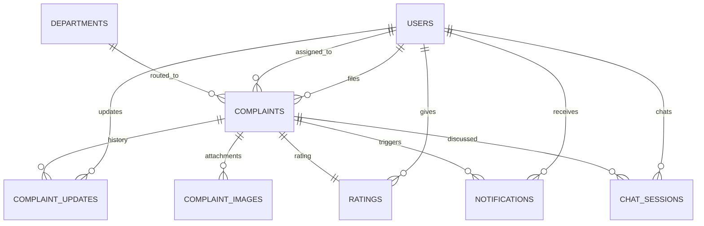

<div align="center">

# 🏛️ NAGRIK AI

### AI-Powered Civic Complaint Management Platform

[](https://python.org)
[](https://fastapi.tiangolo.com)
[](https://vuejs.org)
[](https://postgresql.org)
[](https://redis.io)
[](https://docs.celeryq.dev)

**Team 059** • IIT Madras • Software Engineering • 2026

Report a civic issue by chatting with an AI. It scores urgency, routes it to the right department, and tracks it to resolution.

</div>

---

## 🚀 Quick start

Six steps, in order. Nothing else to read first, just follow this straight through.

### 0️⃣ You need these installed

`Python 3.12+` · `Node.js 18+` · `PostgreSQL` · `Redis` · `Git`

```bash
python3 --version && node --version && psql --version && redis-cli --version
```

### 1️⃣ Clone and enter the backend

```bash
git clone https://github.com/24f2000777/MAY2026-Team-059.git
cd MAY2026-Team-059/Backend
python3 -m venv venv
source venv/bin/activate        # Windows: venv\Scripts\activate
pip install --upgrade pip
pip install -r requirements.txt
```

> [!NOTE]
> The install step downloads a lot, the AI and ML libraries are large. A few minutes on a normal connection is normal, not stuck.

### 2️⃣ Set up `.env`

```bash
cp .env.example .env
```

Open it and fill in **only these five things**:

| Variable | What to put |
|---|---|
| `DATABASE_URL` / `SYNC_DATABASE_URL` | Same Postgres database, two different drivers. Create it first with `sudo -u postgres psql -c "CREATE DATABASE nagrik_ai;"` if it's local |
| `SECRET_KEY` / `OTP_SECRET_KEY` | Two different 32+ char random strings, generate with `python3 -c "import secrets; print(secrets.token_hex(32))"` |
| `GROQ_API_KEY` | Powers the chatbot and priority scoring. `GEMINI_API_KEY`/`HUGGINGFACE_API_KEY` are optional automatic fallbacks |
| SMTP settings | **Leave exactly as they are.** `.env.example` already ships real, working Ethereal test-inbox credentials |
| `REDIS_URL` | `redis://localhost:6379/0` for a local install, no setup needed |

### 3️⃣ Start Postgres and Redis, then migrate

```bash
redis-cli ping              # must print PONG
alembic upgrade head        # creates every table, rerun after pulling new migrations
```

### 4️⃣ Start the backend, in 3 terminals

| Terminal | Command | What it's for |
|---|---|---|
| 1 | `celery -A app.core.celery_app worker --loglevel=info` | Sends verification emails |
| 2 | `celery -A app.core.celery_app beat --loglevel=info` | Nightly priority rescore, optional for local testing |
| 3 | `uvicorn app.main:app --reload` | The actual API, at `http://127.0.0.1:8000` |

(`source venv/bin/activate` first, in each one.) Once terminal 3 says startup complete, open **`http://127.0.0.1:8000/docs`** to confirm it's alive.

### 5️⃣ Start the frontend

```bash
cd ../frontend
npm install
npm run dev
```

Open the URL it prints, almost always **`http://localhost:5173`**.

✅ **That's it, you're running.** Log in with the shared team admin below, or register your own citizen account.

---

## 🔑 Shared team login

Everyone points at the same Supabase database, so there's exactly one admin account, shared by the whole team, not per-person.

```
email:    admin@nagrikai.team
password: Nagrik@2026
```

> [!WARNING]
> This account can hard-delete complaints and manage every user. Keep it out of anywhere public, screenshots included. Use it to create staff accounts too, through `POST /admin/users`, there's no signup page for staff or admin.

---

## 🩹 Hit an error? Check here first

| You see this | It means this | Fix |
|---|---|---|
| `Address already in use` | An old server is still running on that port | `lsof -nP -iTCP:8000 -sTCP:LISTEN` then `kill <pid>` (swap `8000` for `5173` for the frontend) |
| Login says it can't reach the server | Frontend and backend are on mismatched ports | Backend only accepts `5173`/`3000`. If Vite printed `5174` instead, free `5173` and restart it |
| OTP email never arrives | The Celery worker isn't running, or SMTP is still a placeholder | Start terminal 1 above, or check `.env` still has the real Ethereal values from `.env.example` |
| `column does not exist` / missing table | Database schema is behind | `cd Backend && alembic upgrade head` |
| `create_admin` refuses to run | Working as intended, only one admin allowed | Use the shared login above instead |
| Chatbot hangs or never replies | The AI provider hit a rate limit | Wait a minute and retry, or add `GEMINI_API_KEY`/`HUGGINGFACE_API_KEY` as fallbacks |
| Complaints or accounts you didn't create | Shared database, a teammate's test data | Expected. Don't delete anything that isn't clearly yours without asking first |

---

## 🧭 What this actually does

A citizen reports a problem, a pothole, a water leak, a broken streetlight, either through a form or by just describing it to an AI assistant called **Nagrik Saathi**. The system reads it, scores how urgent it is, decides which BMC department should handle it, and checks for duplicates. Staff and admins review, assign, and resolve it, the citizen gets notified at every step, and once it's fixed they confirm it and leave a rating.

Auth, the full complaint lifecycle, attachments, notifications, feedback, and staff/admin account creation are all real and tested against a live Postgres database, both on the backend and, for the core flow, on the frontend too. The three analytics pages, the profile page, and the general feedback form still run on sample data in the browser, see the status section in the full reference below for exactly where that line is.

---

## 🔄 Try the full lifecycle yourself

1. **Citizen:** file a complaint through Nagrik Saathi, or `POST /complaints` directly.
2. **Admin:** `PATCH /complaints/{id}/approve`, then `PATCH /complaints/{id}/assign`.
3. **Staff:** `PATCH /complaints/{id}/start`, then `PATCH /complaints/{id}/resolve`.
4. **Citizen:** check `GET /notifications`, one entry per step above.
5. **Citizen:** `POST /complaints/{id}/feedback` with a score 1 to 5, this auto-closes the complaint.

Every call is real, hits the real database, nothing here is faked for a demo.

```bash
cd Backend && pytest        # the real test suite, 30+ minutes, real DB + real AI calls, no mocks
```

---

<details>
<summary><strong>📚 Full reference: frontend, backend, every endpoint, error codes, architecture, team</strong></summary>

## Frontend reference

A Vue 3 app for citizens, staff, and admins. Vue 3.5 with `<script setup>`, Vue Router 5 with role based guards, Pinia 3, Vite 8. No UI kit, no chart library, every chart is hand built SVG.

### What's real vs sample data

| API file | Talks to |
|---|---|
| `api/authApi.js` | Real backend, register, verify, resend, login, logout |
| `api/chatApi.js` | Real backend, Nagrik Saathi, real AI replies |
| `api/complaintApi.js` | Real backend, submission, listing, detail, every lifecycle transition, attachments, feedback, officer list |
| `api/notificationApi.js` | Real backend, listing, unread count, mark read, delete, preferences |
| `api/client.js` | Sample data, only the 3 analytics pages, `Profile.vue`, and `FeedbackReport.vue` still use it |

`FeedbackReport.vue` is a deliberate gap, not an oversight, the real feedback system is always a rating on one specific resolved complaint, there's no endpoint for untargeted app feedback yet. The admin dashboard's complaint list also caps at 100 with no pagination UI yet.

### What each role can do

- **Citizens:** real dashboard (`GET /complaints/mine`), real complaint detail with status, history, attachments, and a real rating flow. The report form itself is still sample data, use the chatbot instead.
- **Staff:** real task list (`GET /complaints?assigned_to=`), contextual Start Work / Mark Resolved buttons that match the actual state machine, not a free-form dropdown.
- **Admins:** real dashboard, real Approve and Assign/Reassign actions pulling a real staff list from `GET /admin/officers`. No Reject button in the UI yet, though the backend supports it.
- **Everyone:** a real notifications feed with mark read / mark all read / delete.

### Folder layout

```
frontend/src/
├── pages/          LandingPage, Login, Register, VerifyOtp, CitizenDashboard, SubmitComplaint (sample),
│                   ComplaintDetail, RateReview, StaffDashboard, ComplaintUpdate, AdminDashboard,
│                   AssignmentPage, NagrikSaathi, Notifications, Profile (sample), FeedbackReport (sample),
│                   AnalyticsPage/CitizenAnalytics/StaffAnalytics (sample), Faqs, PrivacyPolicy, etc.
├── components/     Navbar, DashboardHero, ActionTile, ComplaintCard, StatusBadge, StatCard, DonutChart, LineChart
├── stores/         authStore.js (real), chatStore.js (real), complaintStore.js (sample, analytics pages only)
├── api/            client.js (sample), httpClient.js (real fetch wrapper, handles multipart), authApi.js,
│                   chatApi.js, complaintApi.js, notificationApi.js (all real)
├── router/index.js
└── assets/style.css
```

Most complaint pages call `complaintApi.js`/`notificationApi.js` directly from their own `onMounted` hook with local `ref` state, rather than through a shared store, that was a deliberate choice over retrofitting the old synchronous mock store for real async calls.

## Backend reference

FastAPI, async throughout, SQLAlchemy 2.0 + asyncpg, JWT auth, Redis for OTP/rate limiting/token revocation, Celery for background email and the nightly rescore, Alembic for migrations, LangGraph for the chatbot with real retrieval augmented answers. Groq is the primary AI provider, Gemini and HuggingFace are automatic fallbacks.

Every protected endpoint expects `Authorization: Bearer <access_token>`. Access tokens last 30 minutes, refresh tokens 7 days.

**Response envelope:**
```json
{ "success": true, "message": "Login successful.", "data": { "...": "..." }, "meta": null }
{ "success": false, "message": "Invalid email or password.", "error_code": "AUTH_001", "details": null }
```

### Endpoints

**`/auth`:** `POST /register`, `/verify-otp`, `/resend-otp`, `/login`, `/refresh`, `/logout`, `GET /me`, `PUT /me`, `POST /change-password`, `/forgot-password`, `/reset-password`

**`/admin`:** `POST /users` (create staff, admin only), `GET /officers` (list staff, admin only). No endpoint creates the admin itself, see `scripts/create_admin.py`.

**`/complaints`:** `POST` (create), `GET` (list, role filtered), `GET /mine`, `GET /wards`, `GET /ward/{id}`, `GET /category/{category}`, `GET /{id}`, `PATCH /{id}` (edit), `DELETE /{id}` (admin), `GET /{id}/history`, `GET`/`POST /{id}/updates` (internal notes), `PATCH /{id}/approve`, `/reject`, `/assign`, `/start`, `/resolve`, `/withdraw`, `/close`, `GET`/`POST /{id}/attachments`, `GET`/`POST /{id}/feedback`

**`/attachments`:** `GET`/`DELETE /{id}`

**`/notifications`:** `GET`, `GET /unread-count`, `PATCH /read-all`, `PATCH /{id}/read`, `DELETE /{id}`, `POST /preferences`. Created synchronously, in the same request, no background job.

**`/feedback`:** `GET /officer/{id}`, `GET /summary` (both admin only)

**`/chat`:** `POST /message`, `GET /history/{session_id}`

**`/ml`:** `GET`/`POST /priority/{id}`, `POST /rescore-all`, `GET`/`POST /categorize/{id}`, `GET`/`POST /route-department/{id}`, `GET /high-risk`, `POST /check-duplicate`, `GET /duplicates/{id}`

**`/dashboard`:** `GET /citizen`, `/staff`, `/admin`, `/internal`

### The complaint state machine

```
submitted --approve--> approved --start--> in_progress --resolve--> resolved --close--> closed
    \                       \
     \--reject--> rejected   \--reject--> rejected

submitted --withdraw--> withdrawn
```

Approve/reject are admin only. Start/resolve need the complaint assigned, and a staff caller must be the actual assignee. Withdraw/close are citizen-only, on their own complaint. Feedback is an alternate path to close that also leaves a rating.

### Error codes

| Code | Meaning | HTTP |
|---|---|---|
| AUTH_001 | Wrong email/password | 401 |
| AUTH_002 | Token expired | 401 |
| AUTH_003 | Token invalid, malformed, or revoked | 401 |
| AUTH_004 | No permission | 403 |
| AUTH_005 | Account inactive | 403 |
| AUTH_006 | Email not verified | 403 |
| AUTH_007 | Email already registered | 409 |
| AUTH_008 | Phone already registered | 409 |
| AUTH_009 | User not found | 404 |
| AUTH_010 | OTP invalid/expired | 400 |
| AUTH_011 | Account already verified | 409 |
| AUTH_012 | Chat session belongs to someone else | 403 |
| COMP_001 | Complaint not found | 404 |
| COMP_002 | Not a real staff account | 422 |
| COMP_003 | Already terminal, nothing to assign | 409 |
| COMP_004 | Transition not allowed from current status | 409 |
| COMP_005 | Not the assigned staff member | 403 |
| COMP_006 | Not your complaint | 403 |
| COMP_007 | Already rated | 409 |
| COMP_008 | Not currently resolved | 409 |
| FILE_001 | File too large | 413 |
| FILE_002 | Unsupported/spoofed file type | 415 |
| FILE_003 | Max attachments reached | 409 |
| FILE_004 | Attachment not found | 404 |
| NOTIF_001 | Notification not found or not yours | 404 |
| RTE_001 | Rate limit exceeded | 429 |
| VAL_001 | No address or coordinates given | 422 |
| VAL_002 | Only one of latitude/longitude given | 422 |

### Backend folder layout

```
Backend/
├── app/
│   ├── api/            auth, admin, complaints, attachments, notifications, feedback, chat, ml, dashboard
│   ├── chatbot/         conversation_graph, extractor, knowledge_base, providers
│   ├── core/             config, database, security, redis, exception_handlers, celery_app
│   ├── dependencies/     auth (get_current_user), roles (require_roles)
│   ├── schemas/           auth, common, complaint, chat, notification, feedback, admin
│   ├── services/           one per domain, plus priority/category/routing/duplicate/risk_alert services
│   ├── tasks/               email_tasks, priority_tasks
│   ├── utils/                constants, exceptions, storage, wards
│   ├── model.py               User, Department, Complaint, ComplaintUpdate, ComplaintImage,
│   │                           Notification, Rating, ChatSession
│   └── main.py
├── alembic/                     every applied migration
├── scripts/                     create_admin.py
├── Testing/                     the real test suite
├── location_validation.py, complaint_assign_schema.py, complaint_internal_notes_schema.py,
│   api-doc.yaml, implementation.md          historical design docs, see below
├── requirements.txt
└── .env.example
```

### Historical design docs

These used to sit loose at the repo root, they've been moved into `Backend/` since that's what they describe. Not imported by anything running.

| File | Described | Real thing now |
|---|---|---|
| `complaint_assign_schema.py` | Assignment endpoint shape | `PATCH /complaints/{id}/assign` |
| `complaint_internal_notes_schema.py` | Internal notes shape | `POST`/`GET /complaints/{id}/updates` |
| `location_validation.py` | Location validation rules | `Backend/app/schemas/complaint.py`, same VAL_001/VAL_002 codes |
| `api-doc.yaml` | Draft OpenAPI contract | Mostly superseded, real contract is `/docs` on a running server |
| `implementation.md` | Early module roadmap | Superseded by the status section below |

### Database

Eight tables: Users, Departments, Complaints, Complaint Updates, Complaint Images, Notifications, Ratings, Chat Sessions.



Every user is `citizen`, `staff`, or `admin`, exactly one admin at a time. `notification_email_enabled` on `users` is the only thing `POST /notifications/preferences` controls, in-app notifications themselves are never optional.

### How auth works underneath

`auth_service.py` holds the business logic, framework agnostic. `security.py` handles password hashing and JWT. `otp_service.py` hashes and stores OTPs in Redis with a matching expiry. `token_blacklist_service.py` handles logout revocation. `rate_limit_service.py` is a general Redis limiter for forgot-password, resend-OTP, and OTP verification attempts. Every failure raises a specific exception, converted to the standard error shape by `exception_handlers.py`.

Passwords are bcrypt hashed, never logged. Access and refresh tokens carry a distinguishing claim and a unique id for real server-side logout. `require_roles` is the single reusable RBAC dependency, tested from an attacker's perspective in `test_rbac_security.py` (forged signatures, tampered payloads, expired tokens).

Staff and admin accounts can't be created through registration at all, ever. The one admin is created once via `scripts/create_admin.py`, which refuses to run again once an admin exists. That admin is the only account that can create staff, via `POST /admin/users`, which has no role field, it can only ever create staff.

### Notifications, feedback, and Celery

A notification is created synchronously, same request and transaction, on approve/reject/start/resolve (notifies the citizen), assign (notifies staff), and citizen-confirmed close whether direct or via feedback (notifies staff). High-risk complaints notify every admin instead. No Celery involved.

A citizen leaves exactly one rating per complaint, 1 to 5 stars plus optional text, only while resolved. Submitting it closes the complaint in the same call, reusing the standalone close transition, so it triggers the same staff notification.

Celery sends verification/reset email asynchronously, and Beat runs a nightly 2 AM IST priority rescore. That's all it does today, scheduled auto-close and PDF reports are planned, not built.

### Where the project actually stands

**Done and tested, backend and frontend:** the full auth flow, admin bootstrap, staff creation, RBAC, the complete complaint lifecycle, automatic notifications on every transition, feedback with auto-close, the chatbot filing real complaints. Covered by a real passing test suite and verified by hand end to end in the browser.

**Done and tested on the backend, no frontend page yet:** attachment upload/fetch/delete, the reject action, ward/category filtering, complaint history as its own endpoint, feedback summary and per-officer aggregation.

**Still sample data on the frontend:** the 3 analytics pages, profile editing and password reset, the general feedback form (no matching backend endpoint exists for it).

**Known limitation:** the admin dashboard's complaint list has no pagination, caps at the first 100.

**Planned, not started:** scheduled auto-closing of stale resolved complaints, department management endpoints, a broader analytics dashboard, Docker/CI deployment setup, a dedicated security audit before any real launch.

## How we work as a team

```bash
git checkout develop
git pull origin develop
git checkout -b feature/your-feature-name
# work, commit in small chunks
git push -u origin feature/your-feature-name
# open a pull request into develop
```

Nothing merges directly into `main`. Before opening a PR: code runs, no hardcoded secrets, tests pass, new dependencies are in `requirements.txt`. Schema changes need a real Alembic migration, generated with `alembic revision --autogenerate -m "..."` and reviewed by hand.

### The team

| Name | Owns |
|---|---|
| Amit Kumar Pandey | Backend architecture, auth, complaint APIs, database |
| Akshit | AI engine, priority prediction, RAG chatbot |
| Ravisha | Testing, QA, complaint schema design, docs |
| Lakshay Bansal | Frontend, Vue pages, routing, auth store |
| Arubhi Bansal | Scrum master, frontend support |

</details>

---

## License

Academic and educational purposes only, part of IIT Madras's Software Engineering coursework. All rights remain with the project's contributors unless stated otherwise.
