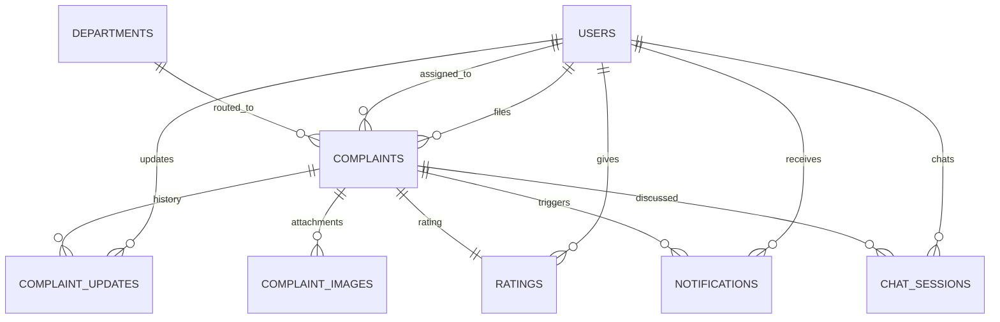

<div align="center">

# 🏛️ NAGRIK AI

### Report a civic problem. Know it's being fixed. Stop chasing anyone for updates.

[](https://python.org)
[](https://fastapi.tiangolo.com)
[](https://vuejs.org)
[](https://postgresql.org)
[](https://redis.io)
[](https://docs.celeryq.dev)

**Team 059** · IIT Madras · Software Engineering · 2026

</div>

---

## 🕳️ The problem this solves

Say a streetlight near your home has been broken for weeks. You call the municipal office, wait on hold, explain the issue, and get told you called the wrong department. You call again. You get a complaint number. Then nothing. No update, no call back, nobody to ask. A week later you're calling again, repeating the same story to someone new.

This happens because most municipal complaint systems today are really just a phone line, a WhatsApp number, and a form nobody checks. Nothing is connected. Nobody can see the full picture. Complaints get lost, duplicated, or sent to the wrong desk, and citizens are left guessing whether anyone is even looking at their problem.

**NAGRIK AI replaces all of that with one connected system.** You report an issue once, in your own words if you want. An AI reads it, figures out how urgent it is, and sends it straight to the right department, no guessing, no wrong desks. From that point on, you can watch it move through every stage, and you'll be notified the moment anything changes.

---

## 🙋 Who this is built for

### 👤 If you're a citizen

You have a civic problem, a pothole, a garbage pile, a leaking pipe, a broken streetlight, and you just want it fixed without becoming a full-time complaint follow-up manager. With NAGRIK AI you can:

- **Report it in seconds**, either by filling a simple form or by just chatting with **Nagrik Saathi**, an AI assistant that asks you a couple of quick questions and files the complaint for you.
- **Attach a photo and your location**, so nobody has to guess where the problem actually is or whether it's real.
- **Watch your complaint move**, from submitted, to approved, to in progress, to resolved, all visible on your own dashboard, no phone calls needed.
- **Get notified automatically** every single time something changes. You never have to ask "any update?" again.
- **Have the final say.** Once someone marks your complaint resolved, you confirm it yourself and leave a rating. If it's genuinely not fixed, it doesn't just get closed on you.

### 👷 If you're municipal staff

You're the person who actually gets sent out to fix things, and right now you're probably getting your assignments by phone call or a message with barely any details. NAGRIK AI gives you:

- **One task list**, showing every complaint assigned to you, with a real address, a photo, and a priority score, not a half-remembered phone call.
- **A clear next action.** Start work, mark it resolved, nothing ambiguous.
- **A way to prove the job is done.** Attach a photo once you've fixed it, so there's a record and the citizen can see it too.

### 🧑‍💼 If you're an administrator

You're responsible for the whole system running smoothly, and spreadsheets don't scale. You get:

- **A live dashboard** of every complaint in the system, filterable by status, category, or area, no more piecing together numbers by hand.
- **One-click approve, reject, or assign**, pulling from a real list of your staff, filtered to the right department automatically.
- **Priority intelligence.** Complaints that look genuinely urgent, a safety risk, a health hazard, are automatically flagged so they don't sit in a queue behind something trivial.
- **Full oversight of accounts and departments**, and an export button when you actually do need a spreadsheet.

---

## 🧭 How it works, start to finish

1. **You describe the problem.** Type it into a form, or just tell Nagrik Saathi what's wrong the way you'd tell a friend.
2. **The AI understands it.** It figures out the category (pothole, garbage, water, streetlight, and more), estimates how urgent it is, and checks it isn't a duplicate of something already reported nearby.
3. **It's routed automatically** to the correct department. You never have to know which office handles what.
4. **A staff member is assigned**, and they see your evidence, your exact location, and the urgency score before they even head out.
5. **You're notified at every step.** Approved, assigned, started, resolved, each one lands as a notification the moment it happens.
6. **You confirm the fix.** Once it's marked resolved, you get the final word, confirm it and rate it, or flag that it isn't actually fixed.

No step in that journey is faked or simulated. Every action in NAGRIK AI hits a real database and produces a real, visible result.

---

## ✨ What makes it different

| | |
|---|---|
| 🤖 **Talk to it, don't fill forms** | Nagrik Saathi understands plain language. "There's a huge pothole outside my building" is enough to start a complaint. |
| 📍 **Evidence that actually helps** | Photos and GPS location travel with the complaint, so field staff go to the right place the first time. |
| ⚡ **Urgency that isn't guesswork** | An AI priority engine scores every complaint and automatically flags the genuinely dangerous ones for immediate attention. |
| 🔔 **You're never left wondering** | Automatic notifications on every status change, plus a live unread badge so nothing gets missed. |
| 🗺️ **One shared source of truth** | Citizens, staff, and administrators all look at the same real data, not three disconnected systems. |
| ✅ **Citizens get the final word** | A complaint can't be quietly closed without the citizen confirming it's actually fixed. |

---

## 🔑 Try it yourself

Everyone on this project shares one demo admin account, since we all point at the same database.

```
email:    admin@nagrikai.team
password: TestPass123!
```

> [!WARNING]
> This account can manage every user and permanently delete complaints. Please don't share it anywhere public. You can also register your own free citizen account any time and file a real complaint to see the whole journey for yourself.

---

## 🛠️ Running it on your own machine

This is the short version, meant for anyone who just wants it running. If you're setting up a fresh development environment or contributing code, the full technical reference below has every detail, including troubleshooting, the complete API surface, and the database schema.

**You'll need:** Python 3.12+, Node.js 18+, PostgreSQL, Redis, and Git.

```bash
git clone https://github.com/24f2000777/MAY2026-Team-059.git
cd MAY2026-Team-059/Backend
python3 -m venv venv && source venv/bin/activate
pip install --upgrade pip && pip install -r requirements.txt
cp .env.example .env        # fill in the database, secret keys, and Groq API key
alembic upgrade head
```

Then, in three separate terminals (each with the virtual environment activated):

```bash
celery -A app.core.celery_app worker --loglevel=info
celery -A app.core.celery_app beat --loglevel=info
uvicorn app.main:app --reload
```

And finally, the frontend:

```bash
cd ../frontend
npm install && npm run dev
```

Open the address it prints, usually `http://localhost:5173`, and you're in.

---

## 💡 What's new lately

The app recently got a full visual redesign across every dashboard, a faster admin experience that no longer freezes while loading complaints, staff can now attach a photo as proof once a job is resolved, and the chatbot now takes you straight to a complaint you just filed instead of leaving you to go find it. See the full, detailed changelog below.

---

<details>
<summary><strong>📚 Full technical reference: setup troubleshooting, every API endpoint, error codes, database schema, and how the team works</strong></summary>

## 🩹 Hit an error? Check here first

| You see this | It means this | Fix |
|---|---|---|
| `Address already in use` | An old server is still running on that port | `lsof -nP -iTCP:8000 -sTCP:LISTEN` then `kill <pid>` (swap `8000` for `5173` for the frontend) |
| Login says it can't reach the server | Frontend and backend are on mismatched ports | Backend only accepts `5173`/`3000`. If Vite printed `5174` instead, free `5173` and restart it |
| OTP email never arrives | The Celery worker isn't running, or SMTP is still a placeholder | Start the Celery worker, or check `.env` still has the real Ethereal values from `.env.example` |
| `column does not exist` / missing table | Database schema is behind | `cd Backend && alembic upgrade head` |
| `could not translate host name "db.....supabase.co"` | `SYNC_DATABASE_URL` is set to the "Direct connection" host, which only resolves over IPv6 | Swap it for the **Session pooler** connection string from Supabase dashboard, under Connect |
| `create_admin` refuses to run | Working as intended, only one admin allowed | Use the shared login above instead |
| Chatbot hangs or never replies | The AI provider hit a rate limit | Wait a minute and retry, or add `GEMINI_API_KEY`/`HUGGINGFACE_API_KEY` as fallbacks |
| Complaints or accounts you didn't create | Shared database, a teammate's test data | Expected. Don't delete anything that isn't clearly yours without asking first |

### Environment variables, in detail

| Variable | What to put |
|---|---|
| `DATABASE_URL` / `SYNC_DATABASE_URL` | Same shared Supabase database, two different drivers. Get both from Supabase dashboard, under Connect. `DATABASE_URL` from the **Transaction pooler**, `SYNC_DATABASE_URL` from the **Session pooler**. Don't use "Direct connection", it only resolves over IPv6 and fails on plenty of networks |
| `SECRET_KEY` / `OTP_SECRET_KEY` | Two different 32+ character random strings, generate with `python3 -c "import secrets; print(secrets.token_hex(32))"` |
| `GROQ_API_KEY` | Powers the chatbot and priority scoring. `GEMINI_API_KEY`/`HUGGINGFACE_API_KEY` are optional automatic fallbacks |
| SMTP settings | Leave exactly as they are. `.env.example` already ships real, working Ethereal test-inbox credentials |
| `REDIS_URL` | `redis://localhost:6379/0` for a local install, no setup needed |

## Frontend reference

A Vue 3 app for citizens, staff, and admins. Vue 3.5 with `<script setup>`, Vue Router 5 with role based guards, Pinia 3, Vite 8. No UI kit, no chart library, every chart is hand built SVG.

### What's real vs sample data

| API file | Talks to |
|---|---|
| `api/authApi.js` | Real backend, register, verify, resend, login, logout |
| `api/chatApi.js` | Real backend, Nagrik Saathi, real AI replies |
| `api/complaintApi.js` | Real backend, submission, listing, detail, every lifecycle transition, attachments, feedback, officer list |
| `api/notificationApi.js` | Real backend, listing, unread count, mark read, delete, preferences |
| `api/analyticsApi.js` | Real backend, `GET /analytics/summary`, scoped by role (citizen sees their own filings, staff their assignments, admin everything) |
| `api/client.js` | Sample data, only `FeedbackReport.vue` still uses it |

`FeedbackReport.vue` is a deliberate gap, not an oversight. The real feedback system is always a rating on one specific resolved complaint, there's no endpoint for untargeted app feedback yet.

### What each role can do

- **Citizens:** real dashboard (`GET /complaints/mine`), a real submit form with map-based location picking, real complaint detail with status, history, attachments, and a real rating flow. Can also delete their own complaint while it's still "submitted", or withdraw it after approval.
- **Staff:** real task list (`GET /complaints?assigned_to=`), contextual Start Work / Mark Resolved buttons that match the actual state machine, not a free-form dropdown.
- **Admins:** real dashboard, real Approve/Reject and Assign/Reassign actions pulling a real staff list from `GET /admin/officers`. Fetches every page of complaints, not capped at 100.
- **Everyone:** a real notifications feed with mark read / mark all read / delete, plus a live unread badge and dashboard reminder banner.

### Folder layout

```
frontend/src/
├── pages/          LandingPage, Login, Register, VerifyOtp, CitizenDashboard, SubmitComplaint,
│                   ComplaintDetail, RateReview, StaffDashboard, ComplaintUpdate, AdminDashboard,
│                   AssignmentPage, NagrikSaathi, Notifications, Profile, FeedbackReport (sample),
│                   AnalyticsPage/CitizenAnalytics/StaffAnalytics, Faqs, PrivacyPolicy, etc.
├── components/     Navbar, DashboardHero, ActionTile, ComplaintCard, StatusBadge, StatCard, DonutChart,
│                   LineChart, NotificationBanner
├── stores/         authStore.js, chatStore.js, notificationStore.js (all real)
├── api/            client.js (sample), httpClient.js (real fetch wrapper, handles multipart), authApi.js,
│                   chatApi.js, complaintApi.js, notificationApi.js, analyticsApi.js (all real)
├── router/index.js
└── assets/style.css
```

Most complaint pages call `complaintApi.js`/`notificationApi.js` directly from their own `onMounted` hook with local `ref` state, rather than through a shared store. That was a deliberate choice over retrofitting the old synchronous mock store for real async calls.

## Backend reference

FastAPI, async throughout, SQLAlchemy 2.0 with asyncpg, JWT auth, Redis for OTP/rate limiting/token revocation, Celery for background email and the nightly rescore, Alembic for migrations, LangGraph for the chatbot with real retrieval augmented answers. Groq is the primary AI provider, Gemini and HuggingFace are automatic fallbacks.

Every protected endpoint expects `Authorization: Bearer <access_token>`. Access tokens last 30 minutes, refresh tokens 7 days.

**Response envelope:**
```json
{ "success": true, "message": "Login successful.", "data": { "...": "..." }, "meta": null }
{ "success": false, "message": "Invalid email or password.", "error_code": "AUTH_001", "details": null }
```

### Endpoints

**`/auth`:** `POST /register`, `/verify-otp`, `/resend-otp`, `/login`, `/refresh`, `/logout`, `GET /me`, `PUT /me`, `POST /change-password`, `/forgot-password`, `/reset-password`

**`/admin`:** `POST /users` (create staff), `GET /officers` (list staff, for an assignment dropdown), `GET`/`POST /departments`, `PATCH`/`DELETE /departments/{id}`, `GET /users` (list, any role, filterable/paginated), `GET /users/{id}` (detail, includes their complaints), `PATCH /users/{id}/status` (activate/deactivate), `PATCH /users/{id}/role`, `PATCH /users/{id}/department` (reassign staff), `GET /export` (CSV, same filters as `GET /complaints`). All admin only. No endpoint creates the admin itself, see `scripts/create_admin.py`.

**`/complaints`:** `POST` (create), `GET` (list, role filtered), `GET /mine`, `GET /wards`, `GET /ward/{id}`, `GET /category/{category}`, `GET /{id}`, `PATCH /{id}` (edit), `DELETE /{id}` (admin, any complaint; or the owning citizen, only while still "submitted"), `GET /{id}/history`, `GET`/`POST /{id}/updates` (internal notes), `PATCH /{id}/approve`, `/reject`, `/assign`, `/start`, `/resolve`, `/withdraw`, `/close`, `GET`/`POST /{id}/attachments` (`purpose: citizen_evidence` by default, or `resolution_proof` for a staff-uploaded proof-of-fix photo once resolved), `GET`/`POST /{id}/feedback`

**`/attachments`:** `GET`/`DELETE /{id}`

**`/notifications`:** `GET`, `GET /unread-count`, `PATCH /read-all`, `PATCH /{id}/read`, `DELETE /{id}`, `POST /preferences`. Created synchronously, in the same request, no background job.

**`/feedback`:** `GET /officer/{id}`, `GET /summary` (both admin only)

**`/analytics`:** `GET /summary`, role-scoped complaint volume and status breakdown (citizen sees their own filings, staff their assignments, admin everything)

**`/chat`:** `POST /message`, `GET /history/{session_id}`

**`/ml`:** `GET`/`POST /priority/{id}`, `POST /rescore-all`, `GET`/`POST /categorize/{id}`, `GET`/`POST /route-department/{id}`, `GET /high-risk`, `POST /check-duplicate`, `GET /duplicates/{id}`

**`/dashboard`:** `GET /citizen`, `/staff`, `/admin`, `/internal`

### The complaint state machine

```
submitted --approve--> approved --start--> in_progress --resolve--> resolved --close--> closed
    \                       \
     \--reject--> rejected   \--reject--> rejected

submitted --withdraw--> withdrawn
```

Approve/reject are admin only. Start/resolve need the complaint assigned, and a staff caller must be the actual assignee. Withdraw/close are citizen-only, on their own complaint. Feedback is an alternate path to close that also leaves a rating.

### Error codes

| Code | Meaning | HTTP |
|---|---|---|
| AUTH_001 | Wrong email/password | 401 |
| AUTH_002 | Token expired | 401 |
| AUTH_003 | Token invalid, malformed, or revoked | 401 |
| AUTH_004 | No permission | 403 |
| AUTH_005 | Account inactive | 403 |
| AUTH_006 | Email not verified | 403 |
| AUTH_007 | Email already registered | 409 |
| AUTH_008 | Phone already registered | 409 |
| AUTH_009 | User not found | 404 |
| AUTH_010 | OTP invalid/expired | 400 |
| AUTH_011 | Account already verified | 409 |
| AUTH_012 | Chat session belongs to someone else | 403 |
| COMP_001 | Complaint not found | 404 |
| COMP_002 | Not a real staff account | 422 |
| COMP_003 | Already terminal, nothing to assign | 409 |
| COMP_004 | Transition not allowed from current status | 409 |
| COMP_005 | Not the assigned staff member | 403 |
| COMP_006 | Not your complaint | 403 |
| COMP_007 | Already rated | 409 |
| COMP_008 | Not currently resolved | 409 |
| FILE_001 | File too large | 413 |
| FILE_002 | Unsupported/spoofed file type | 415 |
| FILE_003 | Max attachments reached | 409 |
| FILE_004 | Attachment not found | 404 |
| NOTIF_001 | Notification not found or not yours | 404 |
| RTE_001 | Rate limit exceeded | 429 |
| VAL_001 | No address or coordinates given | 422 |
| VAL_002 | Only one of latitude/longitude given | 422 |

### Backend folder layout

```
Backend/
├── app/
│   ├── api/            auth, admin, complaints, attachments, notifications, feedback, chat, ml, dashboard
│   ├── chatbot/         conversation_graph, extractor, knowledge_base, providers
│   ├── core/             config, database, security, redis, exception_handlers, celery_app
│   ├── dependencies/     auth (get_current_user), roles (require_roles)
│   ├── schemas/           auth, common, complaint, chat, notification, feedback, admin
│   ├── services/           one per domain, plus priority/category/routing/duplicate/risk_alert services
│   ├── tasks/               email_tasks, priority_tasks
│   ├── utils/                constants, exceptions, storage, wards
│   ├── model.py               User, Department, Complaint, ComplaintUpdate, ComplaintImage,
│   │                           Notification, Rating, ChatSession
│   └── main.py
├── alembic/                     every applied migration
├── scripts/                     create_admin.py
├── Testing/                     the real test suite
├── location_validation.py, complaint_assign_schema.py, complaint_internal_notes_schema.py,
│   api-doc.yaml, implementation.md          historical design docs, see below
├── requirements.txt
└── .env.example
```

### Historical design docs

These used to sit loose at the repo root, they've been moved into `Backend/` since that's what they describe. Not imported by anything running.

| File | Described | Real thing now |
|---|---|---|
| `complaint_assign_schema.py` | Assignment endpoint shape | `PATCH /complaints/{id}/assign` |
| `complaint_internal_notes_schema.py` | Internal notes shape | `POST`/`GET /complaints/{id}/updates` |
| `location_validation.py` | Location validation rules | `Backend/app/schemas/complaint.py`, same VAL_001/VAL_002 codes |
| `api-doc.yaml` | Draft OpenAPI contract | Mostly superseded, real contract is `/docs` on a running server |
| `implementation.md` | Early module roadmap | Superseded by the status section below |

### Database

Eight tables: Users, Departments, Complaints, Complaint Updates, Complaint Images, Notifications, Ratings, Chat Sessions. Complaints also carries a `complaint_number` (sequential, DB-sequence-backed) alongside its real UUID id, purely for the short `NGK-000123` reference shown in the UI.



Every user is `citizen`, `staff`, or `admin`, exactly one admin at a time. `notification_email_enabled` on `users` is the only thing `POST /notifications/preferences` controls, in-app notifications themselves are never optional.

### How auth works underneath

`auth_service.py` holds the business logic, framework agnostic. `security.py` handles password hashing and JWT. `otp_service.py` hashes and stores OTPs in Redis with a matching expiry. `token_blacklist_service.py` handles logout revocation. `rate_limit_service.py` is a general Redis limiter for forgot-password, resend-OTP, and OTP verification attempts. Every failure raises a specific exception, converted to the standard error shape by `exception_handlers.py`.

Passwords are bcrypt hashed, never logged. Access and refresh tokens carry a distinguishing claim and a unique id for real server-side logout. `require_roles` is the single reusable RBAC dependency, tested from an attacker's perspective in `test_rbac_security.py` (forged signatures, tampered payloads, expired tokens).

Staff and admin accounts can't be created through registration at all, ever. The one admin is created once via `scripts/create_admin.py`, which refuses to run again once an admin exists. That admin is the only account that can create staff, via `POST /admin/users`, which has no role field, it can only ever create staff.

### Notifications, feedback, and Celery

A notification is created synchronously, same request and transaction, on approve/reject/start/resolve (notifies the citizen), assign (notifies staff), and citizen-confirmed close whether direct or via feedback (notifies staff). High-risk complaints notify every admin instead. No Celery involved.

A citizen leaves exactly one rating per complaint, 1 to 5 stars plus optional text, only while resolved. Submitting it closes the complaint in the same call, reusing the standalone close transition, so it triggers the same staff notification.

Celery sends verification/reset email asynchronously, and Beat runs a nightly 2 AM IST priority rescore. That's all it does today, scheduled auto-close and PDF reports are planned, not built.

### Where the project actually stands

**Done and tested, backend and frontend:** the full auth flow, admin bootstrap, staff creation, RBAC, the complete complaint lifecycle including citizen delete and a staff-uploaded resolution photo, attachment upload and viewing, complaint history, automatic notifications on every transition plus a live unread badge/reminder, role-scoped analytics (including the redesigned staff performance page), profile editing and password reset, feedback with auto-close, department management and department-filtered staff assignment, deterministic category-to-department routing, the chatbot filing real complaints (with photos, and now linking straight to the filed complaint) and answering questions. Covered by a real passing test suite and verified by hand end to end in the browser.

**Done and tested on the backend, no frontend page yet:** deleting an individual attachment, ward/category filtering (`GET /complaints/ward/{id}`, `GET /complaints/category/{category}`, the admin dashboard's own category filter is a client-side filter over the generic list, not these), feedback summary and per-officer aggregation.

**Still sample data on the frontend:** the general feedback form (no matching backend endpoint exists for it, see above).

**Planned, not started:** scheduled auto-closing of stale resolved complaints, a broader analytics dashboard, Docker/CI deployment setup, a dedicated security audit before any real launch.

### Detailed changelog

**Staff analytics redesigned:** the "My Performance" page's old category-breakdown bar chart was replaced with a workload overview, a resolution-rate ring, and a work-status breakdown.

**Chatbot links straight to the filed complaint:** filing a complaint through Nagrik Saathi now shows a "View Complaint" link right on the confirmation card, instead of leaving you to go find it yourself.

**Admin dashboard redesigned, with pagination:** a visual overhaul of the admin complaint-management screen (new hero/live-snapshot layout, filter toolbar, per-row priority/officer detail), plus proper pagination instead of dumping every complaint into one long table.

**Resolution-rating page redesigned:** `RateReview.vue` now matches the rest of the app's visual language instead of looking like a leftover prototype.

**Staff can attach a resolution photo:** once a complaint is resolved, staff can upload a photo as proof, visible to the citizen on the complaint detail page. Reuses the existing attachment upload endpoint with `purpose: resolution_proof` rather than a new endpoint.

**Department management is real, not planned:** admins can create/list/update/delete departments (`POST`/`GET /admin/departments`, `PATCH`/`DELETE /admin/departments/{id}`) and reassign a staff member's department (`PATCH /admin/users/{id}/department`), from a fixed set of BMC departments. Complaint routing to a department is now deterministic (category to department lookup) instead of going through an LLM call, and staff assignment is filtered to officers in the complaint's own department.

**Groq model swap:** `llama-3.3-70b-versatile` was decommissioned upstream, the chatbot and priority scoring now use the current Groq model instead.

**Redesign and real submit form:** the whole app got a visual redesign (Leaflet map for picking a complaint's location, new layouts throughout). `SubmitComplaint.vue` used to be a disconnected prototype with a fake stub submit and a made-up category list, it's now wired to the real backend (`createComplaint`, `uploadAttachment`, `getWards`), with the map defaulting to Mumbai instead of New Delhi.

**Attachments visible to staff/admin:** photos a citizen attaches to a complaint now show up on the staff and admin views too, not just the citizen's own.

**Chatbot photo uploads fixed:** a photo attached through Nagrik Saathi could silently fail to upload with no error and no way to retry, which is why it sometimes never showed up on the staff/admin side. Now a failed upload surfaces an error and stays attached for retry instead of vanishing. You can also send a photo on its own now, without typing anything first.

**Citizens can delete their own complaint:** while it's still "submitted" (before any officer has approved it), a citizen can now delete it outright, from the complaint detail page or `DELETE /complaints/{id}`. Once it's been approved, withdraw is the option instead.

**Notification reminders:** a red badge on the navbar bell shows the live unread count, and a dismissible banner on every dashboard (citizen, staff, admin) reminds you when there's something unread. The backend for this already existed, it just had no UI surface before.

**Admin dashboard loads faster:** it used to fetch every page of complaints one at a time in sequence. Now it fetches the first page, then every remaining page in parallel, no more 100-complaint cap either.

**Admin can reject complaints:** the Reject action existed on the backend but nothing in the UI called it, only Approve did. There's now a Reject button next to Approve for any "submitted" complaint, prompting for a reason.

**Short complaint reference numbers:** every complaint now has a sequential number (`NGK-000123`) shown everywhere instead of the raw UUID, backed by a real DB sequence so it's assigned atomically. The UUID is still the real id for URLs and API calls, this is purely for display.

### Try the full lifecycle yourself, via the API

1. **Citizen:** file a complaint through Nagrik Saathi, or `POST /complaints` directly.
2. **Admin:** `PATCH /complaints/{id}/approve`, then `PATCH /complaints/{id}/assign`.
3. **Staff:** `PATCH /complaints/{id}/start`, then `PATCH /complaints/{id}/resolve`.
4. **Citizen:** check `GET /notifications`, one entry per step above.
5. **Citizen:** `POST /complaints/{id}/feedback` with a score 1 to 5, this auto-closes the complaint.

Every call is real, hits the real database, nothing here is faked for a demo.

```bash
cd Backend && pytest        # the real test suite, 30+ minutes, real DB and real AI calls, no mocks
```

## How we work as a team

```bash
git checkout develop
git pull origin develop
git checkout -b feature/your-feature-name
# work, commit in small chunks
git push -u origin feature/your-feature-name
# open a pull request into develop
```

Nothing merges directly into `main` without a reviewed pull request. Before opening a PR: code runs, no hardcoded secrets, tests pass, new dependencies are in `requirements.txt`. Schema changes need a real Alembic migration, generated with `alembic revision --autogenerate -m "..."` and reviewed by hand.

### The team

| Name | Owns |
|---|---|
| Amit Kumar Pandey | Backend architecture, auth, complaint APIs, database |
| Akshit | AI engine, priority prediction, RAG chatbot |
| Ravisha | Testing, QA, complaint schema design, docs |
| Lakshay Bansal | Frontend, Vue pages, routing, auth store |
| Arubhi Bansal | Scrum master, frontend support |

</details>

---

## License

Academic and educational purposes only, part of IIT Madras's Software Engineering coursework. All rights remain with the project's contributors unless stated otherwise.
