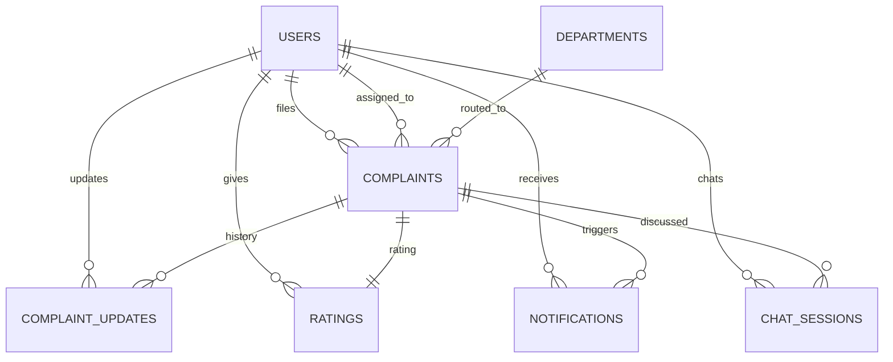

<div align="center">

# 🏛️ NAGRIK AI

### AI-Powered Civic Complaint Management Platform

[](https://python.org)
[](https://fastapi.tiangolo.com)
[](https://vuejs.org)
[](https://postgresql.org)
[](https://redis.io)
[](https://docs.celeryq.dev)

**Team 059** • IIT Madras • Software Engineering • 2026

</div>

---

## 📍 You are on: `integration/auth-schema-complaint-docs`

This branch is not a single feature — it's **7 previously-separate branches combined, tested together, and fixed where they broke each other**: real backend auth (#110), the chatbot wired to the real backend (#111), the chatbot filing real complaints (#115), complaint schema design docs (#106, #107, #88), and a security/RBAC test pass (salvaged from #117). It is currently open as [PR #118](../../pull/118) against `develop`, not merged yet.

**If you just pulled this branch and are confused about what's real vs. mocked vs. just-a-design-doc, read this table first:**

| Area | Status here | Where the code lives |
|---|---|---|
| Login / Register / Verify OTP / Logout | ✅ Real backend, no more mock | `frontend/src/stores/authStore.js`, `Backend/app/api/auth.py` |
| Nagrik Saathi chatbot | ✅ Real backend, real LLM replies | `frontend/src/pages/NagrikSaathi.vue`, `Backend/app/chatbot/` |
| Chatbot filing an actual complaint | ✅ Real — chat "I want to report a pothole" and it creates a row in `complaints` | `Backend/app/services/chat_service.py` |
| `POST /complaints` (submit a complaint via the form) | ✅ Real, scores + routes it immediately | `Backend/app/api/complaints.py` |
| RBAC / role-based route protection | ✅ Real, with 5 attacker-perspective tests | `Backend/app/dependencies/roles.py`, `Backend/Testing/test_rbac_security.py` |
| Complaint assign / internal-notes schemas at repo root | 📄 **Design docs only — not wired into the running app yet.** See [§ Root-Level Design Docs](#-root-level-design-docs-not-wired-in) | `complaint_assign_schema.py`, `complaint_internal_notes_schema.py`, `api-doc.yaml`, `location_validation.py` |
| Everything else (profile, notifications, ratings, admin assignment UI) | 🟡 Still frontend `localStorage` mock | `frontend/src/api/client.js` |

---

## 🚀 Quick Start (both sides, from zero)

```bash
git clone https://github.com/24f2000777/MAY2026-Team-059.git
cd MAY2026-Team-059
git checkout integration/auth-schema-complaint-docs
```

**1. Backend** — needs Python 3.12+, PostgreSQL 14+, Redis 7+ already installed and running.

```bash
cd Backend
python3 -m venv venv
source venv/bin/activate        # Windows: venv\Scripts\activate
pip install --upgrade pip
pip install -r requirements.txt
cp .env.example .env             # then fill it in — see § Environment Configuration
```

Create the database once:
```bash
sudo -u postgres psql -c "CREATE DATABASE nagrik_ai;"
```

Run it (three terminals — email sending and the nightly priority rescore are background jobs):
```bash
# Terminal 1
celery -A app.core.celery_app worker --loglevel=info
# Terminal 2
celery -A app.core.celery_app beat --loglevel=info
# Terminal 3
uvicorn app.main:app --reload
```
- API: http://127.0.0.1:8000 · Swagger UI: http://127.0.0.1:8000/docs · Health check: http://127.0.0.1:8000/health

**2. Frontend** — needs Node.js 18+.

```bash
cd frontend
cp .env.example .env             # only needed if your backend isn't on localhost:8000
npm install
npm run dev
```
Open the URL Vite prints (usually http://localhost:5173).

**3. Try it** — register a citizen account at `/register`, verify the OTP (see [§ How to Get an OTP Without Real SMTP](#-how-to-get-an-otp-without-setting-up-real-smtp) if you don't want to configure email), log in, then either fill out "Report an Issue" or just tell Nagrik Saathi about a problem in chat — both create a real row in the `complaints` table.

---

# 🖥 Frontend

A Vue 3 app for citizens, municipal staff, and administrators. Citizens file complaints (via a form or by chatting with Nagrik Saathi) with photos and location pins, staff manage assigned tasks, admins oversee everything with filters and analytics.

## Tech Stack
- **Vue 3.5** — Composition API, `<script setup>`
- **Vue Router 5** — routing, role-based route guards
- **Pinia 3** — state management
- **Vite 8** — dev server and build tool
- No UI kit, no chart library — all charts (donut, line, bar) and styling are hand-built with SVG and CSS, kept dependency-light on purpose.

## What's real vs. mocked, precisely

| Store / API file | Talks to | Notes |
|---|---|---|
| `stores/authStore.js` → `api/authApi.js` | **Real backend** | register, verifyOtpAndLogin, resendOtp, login, logout — see § Auth Flow below |
| `stores/chatStore.js` → `api/chatApi.js` | **Real backend** | Nagrik Saathi — real LLM replies, real chat history persisted per user |
| `stores/complaintStore.js` → `api/client.js` | **Mock (`localStorage`)** | complaints list/detail/create-via-form (the *page*, not the chatbot path), ratings |
| Profile / notifications / password reset | **Mock (`localStorage`)** | not part of this integration pass |

`api/client.js` is clearly commented as mock-only at the top of the file. Every exported function is written to match what a real REST endpoint would expect, so wiring the real backend later means only rewriting function bodies in that one file.

## Auth Flow — step by step

1. **Register**: `/register` — name, email, 10-digit phone, password (8+ chars) + confirm. Calls `POST /auth/register`, which creates an **unverified** account and emails a real 6-digit OTP.
2. **Verify**: lands on `/verify-otp`. Enter the code. Calls `POST /auth/verify-otp`, which activates the account **and returns real access/refresh tokens directly** — no separate login call, and the frontend never has to hold onto the plaintext password to make one. Redirects to `/citizen`.
3. **Didn't get the email?** "Resend code" calls the dedicated `POST /auth/resend-otp` with just the email — no need to resubmit the whole form. Rate-limited to 3 requests/hour per email.
4. **Log in**: `/login` — email + password against `POST /auth/login`, redirects to `/citizen`, `/staff`, or `/admin` by role. Session (user + tokens) is stored under `localStorage['nagrik_session']`.
5. **Log out**: revokes the token **server-side** via `POST /auth/logout` — the same access token can't be reused afterward even before it naturally expires.

**Security note, if you're wondering why the frontend never stores your password:** `sessionStorage` only ever holds `{ email }` between register and verify — never the password, never an OTP. This was a real fix (see PR #110's review history) for a prior version that briefly kept the plaintext password around client-side to auto-login after verifying; the backend now returns tokens directly from verify-otp instead, making that unnecessary.

**No signup UI for staff/admin** — the backend always creates `citizen` accounts via `/auth/register`. To test as staff/admin locally, register a citizen account, then:
```sql
UPDATE users SET role = 'staff' WHERE email = 'you@example.com';
-- or role = 'admin'
```

## 🔑 How to Get an OTP Without Setting Up Real SMTP

The OTP is only ever sent by real email — nothing is printed to the backend console. Two options:

**Option A — use the shared Ethereal sandbox** (already the default in `.env.example`): register with any email in the UI, then log into [ethereal.email](https://ethereal.email) with the SMTP credentials from `Backend/.env.example` to read the "sent" email. Nothing is delivered anywhere real, so no personal Gmail/app-password needed.

**Option B — capture it directly**, right after registering through the UI with the *same* email/phone/password (this hits the same "pending account, resend OTP" path, so it's not a duplicate registration error):
```bash
# from Backend/, with the venv activated
python3 -c "
import asyncio
import app.services.auth_service as auth_service_module

def capture(*, recipient, otp):
    print(f'OTP for {recipient}: {otp}')

auth_service_module.send_verification_email = capture

from app.core.database import AsyncSessionLocal
from app.services.auth_service import register_user
from app.schemas.auth import RegisterRequest

async def main():
    async with AsyncSessionLocal() as db:
        await register_user(db, RegisterRequest(
            name='Your Name', phone='9123456789',
            email='you@example.com', password='YourPass123'
        ))

asyncio.run(main())
"
```

## 💬 Nagrik Saathi Chatbot — how it actually works now

`/nagrik-saathi` requires login (no `meta: { public: true }` anymore — it's gated the same way `/notifications`/`/profile` are).

- Every message you send goes to `POST /chat/message`, gets a real LLM reply back (not a scripted/keyword-matched response), and both your message and the reply are saved to the `chat_sessions` table.
- Your session id is generated once per user and persisted in `localStorage` (namespaced per user id), so reloading the page shows your same conversation — `GET /chat/history/{session_id}` loads it back in.
- **You can actually file a complaint just by describing it in chat** — e.g. "there's a huge pothole near Patel Chowk" — the chatbot extracts the category and location from the conversation and calls the exact same `create_complaint()` pipeline `POST /complaints` uses (same priority scoring, same department routing), so a chat-filed complaint is indistinguishable from a form-filed one in the database.
- If a 401 comes back (expired/invalid token), you're redirected to `/login` instead of silently failing.

## Features by Role

### Public / Landing
Marketing landing page, glassmorphism footer, **FAQ**, **Privacy Policy**, **Terms of Service**, **Contact Us** — all reachable without login.

### Citizen
- Dashboard: personalized greeting, quick-action tiles, KPI cards (Total / Submitted / In Progress / Resolved)
- **Report an Issue** — category, description, severity, photo upload, click-to-pin map *(still mock — use the chatbot path above for a real, persisted complaint today)*
- **My Complaints**, **Complaint Detail** (status timeline, Rate & Review once resolved), **My Activity (Analytics)**

### Staff
Dashboard with assigned tasks by priority; **Update Task** (status, notes, history); **My Performance (Analytics)**.

### Admin
Dashboard (KPI cards + filterable table); **Assign / Reassign**; **Analytics** (trend line, donut, bar charts, density heatmap).

### Shared (any logged-in role)
**Nagrik Saathi** (real, see above), **Notifications** (mock feed), **Profile** (mock edit), **Feedback** form, custom **404**.

## Folder Structure

```
frontend/src/
├── pages/
│   ├── LandingPage.vue, Login.vue, Register.vue, VerifyOtp.vue
│   ├── ForgotPassword.vue, ResetPassword.vue   (mock)
│   ├── CitizenDashboard.vue, SubmitComplaint.vue, ComplaintDetail.vue, RateReview.vue, CitizenAnalytics.vue
│   ├── StaffDashboard.vue, ComplaintUpdate.vue, StaffAnalytics.vue
│   ├── AdminDashboard.vue, AssignmentPage.vue, AnalyticsPage.vue
│   ├── NagrikSaathi.vue   (real backend), Notifications.vue, Profile.vue, FeedbackReport.vue
│   ├── Faqs.vue, PrivacyPolicy.vue, TermsOfService.vue, ContactUs.vue
│   └── NotFound.vue
├── components/     Navbar.vue, DashboardHero.vue, ActionTile.vue, footer.vue,
│                   ComplaintCard.vue, StatusBadge.vue, StatCard.vue, DonutChart.vue, LineChart.vue
├── stores/         authStore.js (real), chatStore.js (real), complaintStore.js (mock)
├── api/
│   ├── client.js       Mock data layer for everything not listed below
│   ├── httpClient.js   Real fetch wrapper — unwraps the backend's {success, message, data} envelope
│   ├── authApi.js      Real register/verifyOtp/resendOtp/login/logout calls
│   └── chatApi.js       Real sendChatMessage/getChatHistory calls
├── router/index.js   All routes + role-based guards
└── assets/style.css  Global styling
```

---

# ⚙️ Backend

FastAPI backend, async throughout (SQLAlchemy 2.0 async ORM, `asyncpg`), JWT auth, Redis for OTP/rate-limiting/token-blacklist, Celery for background email + nightly rescoring, LangGraph-based RAG chatbot.

## Tech Stack
**Framework:** FastAPI (async), Python 3.12, Pydantic v2
**Database:** PostgreSQL 15 via SQLAlchemy 2.0 async ORM (`asyncpg`); `psycopg2` (sync) used only by `test_db.py`
**Auth:** JWT (`python-jose`), bcrypt (`passlib`), `HTTPBearer`
**Background:** Redis (OTP storage, token blacklist, rate limiting), Celery (email dispatch, nightly priority rescore)
**AI:** Groq / Gemini / HuggingFace with a fallback chain, LangChain, LangGraph, FAISS, sentence-transformers

## 📡 Complete Endpoint Reference

All protected endpoints require `Authorization: Bearer <access_token>`. Access tokens expire in 30 minutes, refresh tokens in 7 days.

### Auth — `/auth/*` (11 endpoints)
| Method | Path | Auth | Notes |
|---|---|---|---|
| POST | `/register` | ✗ | Creates an unverified citizen account, emails an OTP |
| POST | `/verify-otp` | ✗ | Activates the account, **returns real access + refresh tokens directly** |
| POST | `/resend-otp` | ✗ | Resends the verify OTP for a pending account — email only, rate-limited 3/hour |
| POST | `/login` | ✗ | Returns access + refresh tokens |
| POST | `/refresh` | ✓ | Exchanges a valid refresh token for a new access token (rotates it) |
| POST | `/logout` | ✓ | Revokes the access token (and refresh token, if supplied in the body) |
| GET | `/me` | ✓ | Get own profile |
| PUT | `/me` | ✓ | Update own name/phone |
| POST | `/change-password` | ✓ | Change password while logged in |
| POST | `/forgot-password` | ✗ | Requests a reset OTP, rate-limited 3/hour/email |
| POST | `/reset-password` | ✗ | Completes password reset with the OTP |

### Complaints — `/complaints/*`
| Method | Path | Auth | Notes |
|---|---|---|---|
| POST | `` | ✓ | **Real.** Creates the complaint, then immediately scores priority, routes to a department, and flags high-risk — using the same ML services `/ml/*` exposes individually |
| GET | `/whoami` | ✓ | Debug endpoint, returns the caller's own id/email |

### Chat (Nagrik Saathi) — `/chat/*`
| Method | Path | Auth | Notes |
|---|---|---|---|
| POST | `/message` | ✓ | Sends a message, gets a real LLM reply, logs both to `chat_sessions`. If the message describes a civic issue, may create a real complaint (see § Chatbot above) |
| GET | `/history/{session_id}` | ✓ | Returns every message in a session, scoped to the caller's own sessions (403 if it's someone else's) |

### ML — `/ml/*` (already-built services, exposed individually and reused by `/complaints` and chat)
| Method | Path | Notes |
|---|---|---|
| GET/POST | `/priority/{complaint_id}` | Get/recompute priority score |
| POST | `/rescore-all` | Bulk rescore (also runs nightly via Celery beat) |
| GET/POST | `/categorize/{complaint_id}` | Get/predict category |
| GET/POST | `/route-department/{complaint_id}` | Get/recompute department routing |
| GET | `/high-risk` | List flagged high-risk complaints |
| POST | `/check-duplicate` | Check a draft complaint against existing ones |
| GET | `/duplicates/{complaint_id}` | List known duplicates of a complaint |

### Dashboard — `/dashboard/*`
| Method | Path | Roles allowed | Notes |
|---|---|---|---|
| GET | `/citizen` | citizen | |
| GET | `/staff` | staff | |
| GET | `/admin` | admin | |
| GET | `/internal` | staff **or** admin | Proves `require_roles()` accepts more than one role at once |

### Notifications — `/notifications/*`
Router exists, no endpoints implemented yet (schema/model exist, not wired).

## 📦 Standard Response Envelope

**Success:**
```json
{ "success": true, "message": "Login successful.", "data": { "...": "..." }, "meta": null }
```
**Error:**
```json
{ "success": false, "message": "Invalid email or password.", "error_code": "AUTH_001", "details": null }
```

## Error Codes

| Code | Meaning | HTTP |
|---|---|---|
| `AUTH_001` | Invalid credentials | 401 |
| `AUTH_002` | Token expired | 401 |
| `AUTH_003` | Token invalid (malformed/wrong type/revoked) | 401 |
| `AUTH_004` | Insufficient permissions | 403 |
| `AUTH_005` | Account inactive *(reserved, admin deactivation not built yet)* | 403 |
| `AUTH_006` | Email not verified | 403 |
| `AUTH_007` | Email already registered | 409 |
| `AUTH_008` | Phone already registered | 409 |
| `AUTH_009` | User not found | 404 |
| `AUTH_010` | Invalid or expired OTP | 400 |
| `AUTH_011` | Account already verified | 409 |
| `AUTH_012` | Chat session belongs to another user | 403 |
| `RTE_001` | Rate limit exceeded | 429 |
| `VAL_001` | Neither address nor coordinates given | 422 |
| `VAL_002` | Only one of latitude/longitude given | 422 |

## Example: Submit a Complaint

```bash
curl -X POST http://localhost:8000/complaints \
  -H "Authorization: Bearer $ACCESS_TOKEN" \
  -H "Content-Type: application/json" \
  -d '{
    "title": "Large pothole on main road",
    "description": "There is a dangerous pothole near the school gate causing accidents.",
    "category": "pothole",
    "location": { "latitude": 23.0225, "longitude": 72.5714, "address": "Near Patel Chowk, Patan" }
  }'
```
`title` 5–100 chars, `description` 20–1000 chars, `category` one of `road/pothole/streetlight/drainage/garbage/water_supply/sewage/traffic/electricity/other`, `location` needs either `address` or both `latitude`+`longitude` (or all three).

## 📂 Backend Project Structure

```text
Backend/
├── app/
│   ├── api/
│   │   ├── auth.py            ✅ 11 endpoints
│   │   ├── complaints.py      ✅ POST + /whoami (real, scores/routes on submit)
│   │   ├── chat.py            ✅ 2 endpoints, real LLM + real complaint filing
│   │   ├── ml.py              ✅ 10 endpoints
│   │   ├── dashboard.py       ✅ 5 endpoints (citizen/staff/admin/internal)
│   │   └── notifications.py   stub, no endpoints
│   ├── chatbot/                conversation_graph.py, extractor.py, knowledge_base.py, providers.py — LangGraph RAG
│   ├── core/                   config.py, database.py, security.py, redis.py, exception_handlers.py, celery_app.py
│   ├── dependencies/            auth.py (get_current_user), roles.py (require_roles — ✅ complete RBAC)
│   ├── schemas/                 auth.py, common.py, complaint.py (real, wired), chat.py, notification.py (stub)
│   ├── services/                auth_service.py, complaint_service.py, chat_service.py, otp_service.py,
│   │                             email_service.py, token_blacklist_service.py, rate_limit_service.py,
│   │                             priority_service.py, category_service.py, routing_service.py,
│   │                             duplicate_service.py, risk_alert_service.py, notification_service.py (stub)
│   ├── tasks/                   email_tasks.py, priority_tasks.py, notification_tasks.py (stub)
│   ├── utils/                   constants.py, exceptions.py, validators.py (stub)
│   ├── model.py                 User, Complaint, ComplaintUpdate, Notification, Rating, ChatSession, Department
│   └── main.py
├── Testing/                     97 passing tests (see § Testing)
├── requirements.txt
└── .env.example
```

## ⚙ Environment Configuration

```bash
cp .env.example .env
```
Then fill in database credentials, a random `SECRET_KEY` and `OTP_SECRET_KEY` (keep them different — generate with `python -c "import secrets; print(secrets.token_hex(32))"`), Redis URL, and at least one AI provider key (`GROQ_API_KEY` / `GEMINI_API_KEY` / `HUGGINGFACE_API_KEY`) for the chatbot and categorization to work. SMTP defaults to a shared Ethereal sandbox already filled in — see `.env.example` for the actual values, no real personal email account needed for local dev.

## 🧪 Testing

```bash
cd Backend
pytest
```

**97 passing tests** — 55 auth (full HTTP layer via `httpx.ASGITransport`, including token issuance, resend-otp, and rate limiting), 5 RBAC/security (forged JWT signature, tampered payload, insufficient permissions, multi-role access, expired token — all from an attacker's perspective), plus the existing priority/categorization/routing/duplicate-detection/chatbot/complaint-service suites. Needs Postgres and Redis running. No real emails or LLM calls are mocked away where the test's whole point is proving real behavior — check each suite's own docstring.

Two standalone scripts at the repo root are also worth knowing about (**not** part of the pytest suite, run manually):
```bash
python3 location_validation.py       # 10 smoke-test cases for the location-validation design doc
pytest test_location_validation.py   # 42 tests for the same file
```

## 📄 Root-Level Design Docs (not wired in)

Four files at the repo root are **standalone design documents**, not connected to the running FastAPI app. They exist to design an API contract or schema before it gets integrated, and were combined from several parallel design branches — read them for design intent, don't expect them to be live endpoints:

| File | What it's for | Real, wired-in equivalent (if any) |
|---|---|---|
| `location_validation.py` | Location validation design (lat/lng or address, `VAL_001`/`VAL_002`/`VAL_003` error codes) | `Backend/app/schemas/complaint.py`'s `ComplaintLocation` — a separate, already-integrated implementation with the same VAL_001/VAL_002 rules |
| `api-doc.yaml` | Full OpenAPI 3.0.3 contract draft for complaints/comments/attachments | Not generated from the real app; some parts (priority as client input, structured address, comments) describe a shape the real API doesn't match yet |
| `complaint_assign_schema.py` | Request/response schema design for `PATCH /complaints/{id}/assign` | No real endpoint yet |
| `complaint_internal_notes_schema.py` | Request/response schema design for `POST /complaints/{id}/updates` (staff/admin internal notes) | No real endpoint yet — worth checking whether `ComplaintUpdate` (already a real table) can just be reused instead of a new one |

If you're building the real assign/internal-notes endpoints, start from these two schema files — they're already reviewed and staff/admin terminology is already consistent with the real `ROLE_STAFF` constant.

## 🗄 Database Design

Seven tables: **Users**, **Complaints**, **Complaint Updates**, **Notifications**, **Ratings**, **Chat Sessions**, **Departments**.



`Users.role` is one of `citizen` / `staff` / `admin`.

## 🔐 Auth & Security Architecture (Deep Dive)

```
API Route → auth_service.py (business logic, no FastAPI imports)
              ├── security.py             password hashing, JWT create/decode
              ├── otp_service.py          OTP generate/verify (HMAC-SHA256, Redis, per-purpose TTL)
              ├── email_service.py        SMTP sending
              ├── token_blacklist_service.py   logout revocation
              └── rate_limit_service.py   generic Redis fixed-window limiter (forgot-password, resend-otp, verify-otp attempts)
              → raises a custom exception (utils/exceptions.py) on failure
              → core/exception_handlers.py converts it to the standard error envelope
```

**Password security:** bcrypt, never stored or logged in plaintext.

**JWT:** access/refresh distinguished by a `type` claim; every token carries a unique `jti`, enabling the logout blacklist.

**OTP:** only ever exists in plaintext long enough to be emailed — Redis stores its HMAC-SHA256 hash with a TTL (5 min verify-email, 10 min password-reset). Verifying deletes the Redis entry, so an OTP is single-use.

**Rate limiting:** a generic Redis fixed-window counter (`INCR` + `EXPIRE`), applied to forgot-password (3/hour/email), resend-otp (3/hour/email), and verify-otp attempts (5 per 15 min).

**RBAC (Role-Based Access Control):** `require_roles(*roles)` is a dependency factory — pass one or more roles, get a dependency that 403s anyone else. `test_rbac_security.py` verifies this from an attacker's perspective: forged JWT signatures, tampered payloads with an escalated role but the wrong signature, insufficient-permission 403s, multi-role routes, and expired/invalid tokens — all rejected correctly.

## 🌱 Celery — Background Jobs

- **Email dispatch** — every OTP email goes through `send_email_task` asynchronously.
- **Nightly priority rescore** — Celery Beat runs `rescore_all_complaints_task` at 2 AM IST.
- Not yet used for: notification creation on status change, scheduled auto-close, PDF report generation.

## 📌 Current Status

### ✅ Done and tested
Auth (11 endpoints incl. resend-otp), RBAC, complaint submission (form + chatbot, both real), ML priority/categorization/routing/duplicate-detection, RAG chatbot with real complaint filing, 4 complaint-schema design docs — 97 passing tests.

### 🚧 Mocked / not wired yet
Frontend profile, notifications, password reset, complaint list/detail/ratings pages (still `localStorage`); backend complaint assign/internal-notes endpoints (design docs exist, see above); notifications endpoints (model exists).

### 📋 Planned
Complaint state machine (approve/start/resolve/reject), photo evidence upload, complaint auto-close, Docker/CI-CD, Module 11 pre-launch security audit (secret-leak prevention, personal-data-flow audit, production-config review, deep JWT/role-bypass review).

---

## 👨‍💻 Development Workflow

```bash
git checkout develop
git pull origin develop
git checkout -b feature/your-feature-name
# ...work, commit in small meaningful chunks...
git push -u origin feature/your-feature-name
# open PR: feature/your-feature-name → develop
```
Never merge directly into `main`. Before opening a PR: code compiles, no hardcoded secrets, tests pass, new dependencies added to `requirements.txt`.

## Team

| Name | Responsibility |
|---|---|
| Amit Kumar Pandey | Backend Architecture, Authentication, Complaint APIs, Database |
| Akshit | AI Engine, ML Priority Prediction, RAG Chatbot |
| Ravisha | Testing, QA, Complaint Schema, Documentation |
| Lakshay Bansal | Frontend (Vue 3) — pages, routing, auth store |
| Arubhi Bansal | Scrum master, frontend support |

## License

Academic and educational purposes as part of IIT Madras Software Engineering coursework. All rights remain with the project contributors unless otherwise specified.
