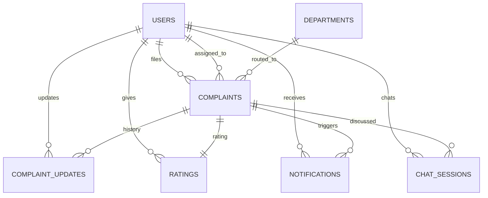

<div align="center">

# 🏛️ NAGRIK AI

### AI-Powered Civic Complaint Management Platform

[](https://python.org)
[](https://fastapi.tiangolo.com)
[](https://vuejs.org)
[](https://postgresql.org)
[](https://redis.io)
[](https://docs.celeryq.dev)

**Team 059** • IIT Madras • Software Engineering • 2026

</div>

---

## 📍 You are on: `develop`

**The most important thing to know about this branch: the backend is real and fairly complete, but the frontend is still 100% running on a `localStorage` mock — including login, register, and the chatbot.** They have not been wired together on `develop` yet. That work exists on a separate branch — see [PR #118](../../pull/118) (`integration/auth-schema-complaint-docs`) if you want the version where the frontend actually talks to this backend.

| Area | Status on `develop` |
|---|---|
| Backend auth (register/verify/login/logout/refresh/reset) | ✅ Real, fully built and tested |
| Frontend login / register / logout | 🟡 **Mock only** — `localStorage`, no network calls to the backend at all |
| Backend `/chat/*` (Nagrik Saathi's real LLM brain) | ✅ Real, real replies persisted to `chat_sessions` |
| Frontend Nagrik Saathi page | 🟡 **Mock only** — scripted keyword-matched replies via `setTimeout`, never calls the real backend |
| `POST /complaints` (submit a complaint) | ❌ Not built — `app/api/complaints.py` only has a debug `/whoami` route |
| ML priority/categorization/routing/duplicate-detection | ✅ Real, exposed individually under `/ml/*` — just not yet triggered automatically on complaint submission, since there's no submission endpoint yet |
| RBAC (role-based route protection) | ✅ Real (`require_roles()`), used by `/dashboard/*` |
| Frontend complaints/profile/notifications/ratings | 🟡 Mock (`localStorage`) |

If you're picking up frontend-backend integration work, `integration/auth-schema-complaint-docs` already did the auth + chatbot half of it — check there before redoing it.

---

## 🚀 Quick Start

```bash
git clone https://github.com/24f2000777/MAY2026-Team-059.git
cd MAY2026-Team-059
git checkout develop
```

**1. Backend** — needs Python 3.12+, PostgreSQL 14+, Redis 7+ already installed and running.

```bash
cd Backend
python3 -m venv venv
source venv/bin/activate        # Windows: venv\Scripts\activate
pip install --upgrade pip
pip install -r requirements.txt
cp .env.example .env             # then fill it in — see § Environment Configuration
sudo -u postgres psql -c "CREATE DATABASE nagrik_ai;"
```

Run it (three terminals):
```bash
# Terminal 1
celery -A app.core.celery_app worker --loglevel=info
# Terminal 2
celery -A app.core.celery_app beat --loglevel=info
# Terminal 3
uvicorn app.main:app --reload
```
API: http://127.0.0.1:8000 · Swagger UI: http://127.0.0.1:8000/docs · Health check: http://127.0.0.1:8000/health

**2. Frontend** (mock data, doesn't need the backend running at all to click through):
```bash
cd frontend
npm install
npm run dev
```
Open the URL Vite prints (usually http://localhost:5173). Demo accounts are auto-seeded into `localStorage` on first run — see § Demo Logins below.

---

# 🖥 Frontend

A Vue 3 app for citizens, municipal staff, and administrators — currently entirely running on mock data.

## Tech Stack
- **Vue 3.5** — Composition API, `<script setup>`
- **Vue Router 5**, **Pinia 3**, **Vite 8**
- No UI kit, no chart library — all charts and styling hand-built with SVG/CSS on purpose.

## About the Mock Data Layer

`src/api/client.js` simulates a backend using `localStorage`. It's clearly commented as mock-only at the top of the file. Every exported function (`registerUser`, `loginUser`, `getComplaints`, `createComplaint`, etc.) is written to match what a real REST endpoint would expect, so connecting a real backend later means rewriting the function bodies in this one file — which is exactly what `integration/auth-schema-complaint-docs` already did for the auth and chat pieces.

Things explicitly **not real** right now, by design:
- Passwords are stored in plaintext in `localStorage`
- OTP codes are generated client-side and shown on screen, not sent via email/SMS
- Nagrik Saathi is a scripted, keyword-matched demo — see `botReplyFor()` in `NagrikSaathi.vue`
- Password reset has no email/token step

## Demo Logins

Accounts are seeded automatically into `localStorage` the first time the app runs.

| Role | Email | Password |
|---|---|---|
| Citizen | citizen@nagrikai.app | citizen123 |
| Staff | ravi.staff@nagrikai.app | staff123 |
| Admin | admin@nagrikai.app | admin123 |

You can also register a new citizen account from scratch. If login ever fails with correct-looking credentials after pulling new code, clear stale local data: DevTools → Application → Local Storage → delete `cr_users` and `cr_session` → refresh.

## Features by Role

### Public / Landing
Marketing landing page, glassmorphism footer, **FAQ**, **Privacy Policy**, **Terms of Service**, **Contact Us**, a live demo of **Nagrik Saathi**.

### Authentication (mock)
Register (name/email/phone/password, phone format + min length validated), OTP verification (demo code shown on screen), Login (redirects by role), Forgot/Reset Password (mocked, no real email).

### Citizen
Dashboard (KPI cards), **Report an Issue** (category/description/severity/photo/map pin), **My Complaints**, **Complaint Detail** (timeline + Rate & Review once resolved), **My Activity (Analytics)**.

### Staff
Dashboard (assigned tasks by priority), **Update Task** (status/notes/history), **My Performance (Analytics)**.

### Admin
Dashboard (KPI cards + filterable table), **Assign/Reassign**, **Analytics** (trend line, donut, bar charts, density heatmap).

### Shared
**Nagrik Saathi** (scripted demo), **Notifications**, **Profile**, **Feedback**, custom **404**.

## Folder Structure

```
frontend/src/
├── pages/           LandingPage, Login/Register/VerifyOtp, ForgotPassword/ResetPassword,
│                    Citizen*/Staff*/Admin* dashboards + sub-pages, NagrikSaathi, Notifications,
│                    Profile, FeedbackReport, Faqs/PrivacyPolicy/TermsOfService/ContactUs, NotFound
├── components/      Navbar, DashboardHero, ActionTile, footer, ComplaintCard, StatusBadge,
│                    StatCard, DonutChart, LineChart
├── stores/          Pinia: authStore.js, complaintStore.js  (both mock)
├── api/client.js    Mock data layer (see above)
├── router/index.js  All routes + role-based guards
└── assets/style.css Global styling
```

---

# ⚙️ Backend

FastAPI backend, async throughout, JWT auth, Redis for OTP/rate-limiting/token-blacklist, Celery for background email + nightly rescoring, LangGraph-based RAG chatbot (real, just not yet reachable from the frontend).

## Tech Stack
**Framework:** FastAPI (async), Python 3.12, SQLAlchemy 2.0 async ORM, Pydantic v2
**Database:** PostgreSQL 15, `asyncpg` (runtime) / `psycopg2` (sync, used by `test_db.py`)
**Auth:** JWT (`python-jose`), bcrypt (`passlib`), `HTTPBearer`
**Background:** Redis, Celery
**AI:** Groq / Gemini / HuggingFace fallback chain, LangChain, LangGraph, FAISS, sentence-transformers

## 📡 Complete Endpoint Reference

### Auth — `/auth/*` (10 endpoints)
| Method | Path | Auth | Notes |
|---|---|---|---|
| POST | `/register` | ✗ | Creates an unverified citizen account, emails an OTP |
| POST | `/verify-otp` | ✗ | Activates the account, returns a success message (not tokens — no auto-login built here yet) |
| POST | `/login` | ✗ | Returns access + refresh tokens |
| POST | `/refresh` | ✓ | Exchanges a refresh token for a new access token |
| POST | `/logout` | ✓ | Revokes the access token (and refresh token if supplied) |
| GET | `/me` | ✓ | Get own profile |
| PUT | `/me` | ✓ | Update own name/phone |
| POST | `/change-password` | ✓ | Change password while logged in |
| POST | `/forgot-password` | ✗ | Requests a reset OTP, rate-limited 3/hour/email |
| POST | `/reset-password` | ✗ | Completes password reset with the OTP |

### Complaints — `/complaints/*`
| Method | Path | Auth | Notes |
|---|---|---|---|
| GET | `/whoami` | ✓ | Debug only — the only route here so far |

### Chat (Nagrik Saathi) — `/chat/*` — real, just not called by the frontend yet
| Method | Path | Auth | Notes |
|---|---|---|---|
| POST | `/message` | ✓ | Sends a message, gets a real LLM reply, logs both to `chat_sessions` |
| GET | `/history/{session_id}` | ✓ | Returns a session's messages, scoped to the caller |

### ML — `/ml/*` (10 endpoints)
`/priority/{id}` (GET/POST), `/rescore-all` (POST, also runs nightly via Celery beat), `/categorize/{id}` (GET/POST), `/route-department/{id}` (GET/POST), `/high-risk` (GET), `/check-duplicate` (POST), `/duplicates/{id}` (GET).

### Dashboard — `/dashboard/*` (4 endpoints)
`/citizen`, `/staff`, `/admin` — each gated to its own role via `require_roles()`.

## 📦 Standard Response Envelope

**Success:** `{ "success": true, "message": "...", "data": {...}, "meta": null }`
**Error:** `{ "success": false, "message": "...", "error_code": "AUTH_001", "details": null }`

## Error Codes

| Code | Meaning | HTTP |
|---|---|---|
| `AUTH_001` | Invalid credentials | 401 |
| `AUTH_002` | Token expired | 401 |
| `AUTH_003` | Token invalid | 401 |
| `AUTH_004` | Insufficient permissions | 403 |
| `AUTH_005` | Account inactive *(reserved)* | 403 |
| `AUTH_006` | Email not verified | 403 |
| `AUTH_007` | Email already registered | 409 |
| `AUTH_008` | Phone already registered | 409 |
| `AUTH_009` | User not found | 404 |
| `AUTH_010` | Invalid or expired OTP | 400 |
| `AUTH_011` | Account already verified | 409 |
| `RTE_001` | Rate limit exceeded | 429 |

## 📂 Backend Project Structure

```text
Backend/
├── app/
│   ├── api/
│   │   ├── auth.py            ✅ 10 endpoints
│   │   ├── ml.py               ✅ 10 endpoints
│   │   ├── chat.py             ✅ 2 endpoints (real, not yet called by the frontend)
│   │   ├── dashboard.py         ✅ 4 endpoints
│   │   ├── complaints.py        stub — /whoami only
│   │   └── notifications.py     stub
│   ├── chatbot/                  conversation_graph.py, extractor.py, knowledge_base.py, providers.py
│   ├── core/                     config.py, database.py, security.py, redis.py, exception_handlers.py, celery_app.py
│   ├── dependencies/              auth.py, roles.py (require_roles — ✅ complete)
│   ├── schemas/                   auth.py, common.py, complaint.py (schema exists, no endpoint uses it yet), notification.py (stub)
│   ├── services/                  auth_service.py, otp_service.py, email_service.py, token_blacklist_service.py,
│   │                               rate_limit_service.py, priority_service.py, category_service.py, routing_service.py,
│   │                               duplicate_service.py, chat_service.py, risk_alert_service.py, notification_service.py (stub)
│   ├── tasks/                     email_tasks.py, priority_tasks.py, notification_tasks.py (stub)
│   ├── utils/                     constants.py, exceptions.py, validators.py (stub)
│   ├── model.py                   User, Complaint, ComplaintUpdate, Notification, Rating, ChatSession, Department
│   └── main.py
├── Testing/                       81 passing tests
├── requirements.txt
└── .env.example
```

## ⚙ Environment Configuration

```bash
cp .env.example .env
```
Fill in DB credentials, `SECRET_KEY` + `OTP_SECRET_KEY` (different values — generate with `python -c "import secrets; print(secrets.token_hex(32))"`), Redis URL, SMTP (a shared Ethereal sandbox is already filled in for local dev, see `.env.example`), and at least one AI provider key for the ML/chat services.

## 🐘 PostgreSQL & Redis Setup

```bash
sudo systemctl start postgresql
sudo -u postgres psql -c "CREATE DATABASE nagrik_ai;"
sudo apt install redis-server
sudo systemctl enable --now redis-server
redis-cli ping   # expect: PONG
```

## 🧪 Testing

```bash
cd Backend
pytest
```

**81 passing tests** across auth (50, full HTTP layer via `httpx.ASGITransport`), priority scoring, categorization/routing, duplicate detection, chatbot persistence, risk alerting. Needs Postgres and Redis running.

## 🗄 Database Design

Seven tables: **Users**, **Complaints**, **Complaint Updates**, **Notifications**, **Ratings**, **Chat Sessions**, **Departments**.



`Users.role` is one of `citizen` / `staff` / `admin`.

## 🔐 Authentication Architecture (Deep Dive)

```
API Route → auth_service.py (business logic, no FastAPI imports)
              ├── security.py             password hashing, JWT create/decode
              ├── otp_service.py          OTP generate/verify (HMAC-SHA256, Redis, per-purpose TTL)
              ├── email_service.py        SMTP sending
              ├── token_blacklist_service.py   logout revocation
              └── rate_limit_service.py   generic Redis fixed-window limiter
              → raises a custom exception (utils/exceptions.py) on failure
              → core/exception_handlers.py converts it to the standard error envelope
```

**Password security:** bcrypt, never stored/logged in plaintext. **JWT:** access/refresh distinguished by a `type` claim, unique `jti` per token enables the logout blacklist. **OTP:** only its HMAC-SHA256 hash lives in Redis, TTL-bound, single-use. **Rate limiting:** generic Redis fixed-window counter, currently applied to forgot-password.

## 🌱 Celery — Background Jobs

Email dispatch (every OTP email, async via `send_email_task`) and the nightly priority rescore (Celery Beat, `rescore_all_complaints_task`, 2 AM IST). Not yet used for notification creation, scheduled auto-close, or PDF reports.

## 📌 Current Status

### ✅ Done and tested
Backend auth (10 endpoints), RBAC, ML priority/categorization/routing/duplicate-detection, RAG chatbot backend — 81 passing tests. Full frontend UI (all pages) — running on mock data.

### 🚧 In Progress
Wiring the frontend to the real backend — **already done for auth + chatbot on `integration/auth-schema-complaint-docs`** (see PR #118), not yet merged here. Complaint CRUD (schema exists, endpoint doesn't).

### 📋 Planned
Complaint submission endpoint, complaint state machine (approve/start/resolve/reject), assignment, internal notes, notifications endpoints, complaint auto-close, photo upload, ratings endpoint, Docker/CI-CD, pre-launch security audit.

---

## 👨‍💻 Development Workflow

```bash
git checkout develop
git pull origin develop
git checkout -b feature/your-feature-name
# ...work, commit in small meaningful chunks...
git push -u origin feature/your-feature-name
# open PR: feature/your-feature-name → develop
```
Never merge directly into `main`. Before opening a PR: code compiles, no hardcoded secrets, README updated if paths/branches changed, tests pass, new dependencies added to `requirements.txt`.

## Team

| Name | Responsibility |
|---|---|
| Amit Kumar Pandey | Backend Architecture, Authentication, Complaint APIs, Database |
| Akshit | AI Engine, ML Priority Prediction, RAG Chatbot |
| Ravisha | Testing, QA, Complaint Schema, Documentation |
| Lakshay Bansal | Frontend (Vue 3) — pages, routing, auth store |
| Arubhi Bansal | Scrum master, frontend support |

## License

Academic and educational purposes as part of IIT Madras Software Engineering coursework. All rights remain with the project contributors unless otherwise specified.
