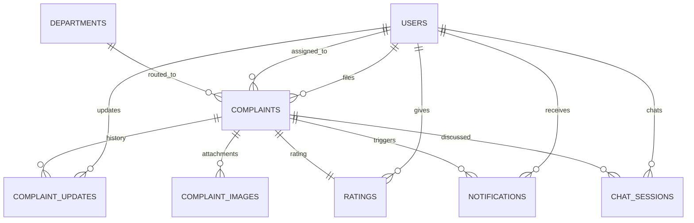

<div align="center">

# 🏛️ NAGRIK AI

### AI-Powered Civic Complaint Management Platform

[](https://python.org)
[](https://fastapi.tiangolo.com)
[](https://vuejs.org)
[](https://postgresql.org)
[](https://redis.io)
[](https://docs.celeryq.dev)

**Team 059** • IIT Madras • Software Engineering • 2026

</div>

---

## What this project actually does

NAGRIK AI is a civic complaint platform for Mumbai. A citizen can report a problem like a pothole, a water leak, or an overflowing drain, either by filling out a form or by just chatting with an AI assistant called Nagrik Saathi about it. The system reads the complaint, figures out how urgent it is, decides which BMC department should handle it, and checks whether it looks like a duplicate of something already reported. Staff and admins review, assign, and resolve these complaints, the citizen gets notified at each step, and once a complaint is fixed the citizen confirms it and can leave a rating.

The backend, on `develop`, is now genuinely large. Authentication, the full complaint lifecycle from submission through approval, assignment, work, resolution, and closure, photo and document attachments, notifications, feedback and ratings, and account creation for staff and admins are all real, tested, and running against an actual Postgres database. The chatbot is a real AI conversation, not a scripted demo. The frontend has mostly caught up now too. Registration, login, complaint submission, the chatbot, complaint detail, feedback and ratings, the staff task workflow, and the admin dashboard with approve and assign actions are all wired to the real backend. Only the three analytics pages, the profile page, and a general untargeted feedback form still run on sample data stored in the browser, since none of those have a matching real endpoint yet or are considered lower priority. This guide walks you through getting the whole thing running on your own machine so you can click around and test it yourself, not just read about it.

---

## Setting everything up on your own machine

This section is written so you can follow it top to bottom without already knowing how the project is put together. If you get stuck anywhere, check the troubleshooting section near the end first, since it covers the exact problems people on this team have already hit while setting this up.

### What you need installed first

You will need Python 3.12 or newer, Node.js 18 or newer, PostgreSQL, Redis, and Git. If you already have these, you can skip ahead. If not, install them for your operating system before continuing (Homebrew on Mac, apt on Linux, or the official installers on Windows all work fine).

Check what you already have with:
```bash
python3 --version
node --version
psql --version
redis-cli --version
```

### Step 1: Get the code

```bash
git clone https://github.com/24f2000777/MAY2026-Team-059.git
cd MAY2026-Team-059
git checkout develop
git pull origin develop
```

### Step 2: Set up the backend

Move into the Backend folder and create a virtual environment. This keeps this project's Python packages separate from anything else on your machine.

```bash
cd Backend
python3 -m venv venv
source venv/bin/activate
```

If you are on Windows, activate it with `venv\Scripts\activate` instead.

Now install everything the backend needs:
```bash
pip install --upgrade pip
pip install -r requirements.txt
```

This step downloads quite a lot, since the AI and machine learning libraries are large. Give it a few minutes on a normal connection.

### Step 3: Set up your environment file

Copy the example environment file and open it in your editor:
```bash
cp .env.example .env
```

You need to fill in a few things:

Your database connection string, pointing at a Postgres database you can reach. If you are running Postgres locally, create the database first:
```bash
sudo -u postgres psql -c "CREATE DATABASE nagrik_ai;"
```

There are actually two database URL variables. `DATABASE_URL` uses the asyncpg driver and is what the running application uses for every request. `SYNC_DATABASE_URL` uses psycopg2 instead and is used only by Alembic, the schema migration tool, and by a couple of standalone scripts that need a plain synchronous connection. Both should point at the same database, just through different drivers.

A `SECRET_KEY` and an `OTP_SECRET_KEY`, each at least 32 characters and different from each other. You can generate a good random one with:
```bash
python3 -c "import secrets; print(secrets.token_hex(32))"
```

At least one AI provider key, since the chatbot and the automatic priority scoring and categorization all depend on this. `GROQ_API_KEY` is the primary one this project uses, and it is genuinely fast and works well. `GEMINI_API_KEY` and `HUGGINGFACE_API_KEY` are backups the system falls through to automatically if Groq is ever slow or temporarily out of quota, so filling those in too makes your local setup much more reliable.

The SMTP settings for sending the verification email. You do not need your own email account for this. The `.env.example` file already has working credentials for a shared test inbox on a site called Ethereal, which is built exactly for this kind of local testing. Just copy those values across as they are, and skip ahead to the section below on how to actually read the OTP once it is sent there.

Your Redis connection URL, which for a local Redis install is usually just `redis://localhost:6379/0` and needs no further setup.

### Step 4: Start Redis and Postgres

Make sure both are actually running before you go any further:
```bash
redis-cli ping
```
This should print `PONG`. If Postgres was already running when you created the database earlier, it is already good to go.

### Step 5: Apply the database schema with Alembic

The database tables are managed through Alembic migrations, not created automatically by the app on startup. Run this once, from the Backend folder, with your virtual environment active and your `.env` filled in:

```bash
alembic upgrade head
```

This creates every table the app needs. If you ever pull down changes that include a new migration file under `alembic/versions/`, run this same command again to bring your local database up to date. You do not need to run this again if nothing new was added.

### Step 6: Create the admin account

There is deliberately no signup page or public API endpoint for creating an admin or a staff account. Every account created through the normal register page is a citizen. The platform is meant to have exactly one admin, and that admin is the only one who can create staff accounts, so the very first admin has to be created directly, once, through a script instead of over the network.

From the Backend folder, with your virtual environment active:
```bash
python -m scripts.create_admin
```

It will ask for a name, phone number, email, and password, then create the account immediately active, no OTP step needed since you are the one running it directly on the machine. If an admin account already exists, the script refuses to run again, on purpose, so you can never accidentally end up with two. Keep these credentials somewhere you will remember them, you will use them to log in and to create staff accounts from inside the app itself, through `POST /admin/users`.

Since the whole team points at the same shared Supabase database, this admin account is already the same account for everyone, there is nothing to individually set up, just log in.

```
email:    admin@nagrikai.team
password: Nagrik@2026
```

Anyone with these credentials can hard delete complaints and create or deactivate accounts, treat them like any other team credential and keep them out of anywhere public, screenshots included.

### Step 7: Run the backend, in three separate terminal windows

The backend is not just one process. Sending the verification email happens in the background through Celery, so you need a Celery worker running, and there is also a nightly job that recalculates complaint priority scores, which needs Celery beat. Open three terminal tabs or windows, activate the virtual environment in each one, and run one of these in each:

Terminal 1, the Celery worker, which actually sends the emails:
```bash
cd Backend
source venv/bin/activate
celery -A app.core.celery_app worker --loglevel=info
```

Terminal 2, Celery beat, which schedules the nightly rescore job. This is not strictly required just to test login and the chatbot, but it is part of the real setup and only takes one more terminal:
```bash
cd Backend
source venv/bin/activate
celery -A app.core.celery_app beat --loglevel=info
```

Terminal 3, the actual API server:
```bash
cd Backend
source venv/bin/activate
uvicorn app.main:app --reload
```

Once that third command settles, you should see a line saying the application startup is complete. The API is now running at `http://127.0.0.1:8000`. You can open `http://127.0.0.1:8000/docs` in a browser right now to see every available endpoint and try them directly, which is a genuinely useful way to explore what the backend can do before you even touch the frontend.

### Step 8: Run the frontend

Open a fourth terminal window, this one does not need the virtual environment since it is a separate Node.js project:

```bash
cd frontend
npm install
npm run dev
```

Vite will print a URL once it starts, almost always `http://localhost:5173`. Open that in your browser.

---

## Actually using the app

Once both sides are running, here is how to try it out yourself.

### Creating a citizen account

Go to the register page and fill in your name, a real-looking email address, a ten digit phone number, and a password. Submit it. The account gets created but starts out unverified, and the backend sends a six digit code to the email address you gave.

Since that email goes through the shared Ethereal test inbox by default, go to [ethereal.email](https://ethereal.email) and log in using the `SMTP_USERNAME` and `SMTP_PASSWORD` values from your `.env` file. You will see the email sitting there with your code in it. Nothing gets delivered anywhere real, so you can use any email address you like when registering.

If you would rather skip the browser step entirely, there is a small script you can run from the Backend folder that registers the same account and prints the code straight to your terminal instead of sending it anywhere:

```bash
python3 -c "
import asyncio
import app.services.auth_service as auth_service_module

def capture(*, recipient, otp):
    print(f'OTP for {recipient}: {otp}')

auth_service_module.send_verification_email = capture

from app.core.database import AsyncSessionLocal
from app.services.auth_service import register_user
from app.schemas.auth import RegisterRequest

async def main():
    async with AsyncSessionLocal() as db:
        await register_user(db, RegisterRequest(
            name='Your Name', phone='9123456789',
            email='you@example.com', password='YourPass123'
        ))

asyncio.run(main())
"
```

Type the code into the verification page. Once accepted, you are logged in immediately and taken to your citizen dashboard.

### Getting a staff account to test with

Log in as the admin account you created with `scripts/create_admin.py` in Step 6, then send a request to create a staff account:

```bash
curl -X POST http://localhost:8000/admin/users \
  -H "Authorization: Bearer $ADMIN_ACCESS_TOKEN" \
  -H "Content-Type: application/json" \
  -d '{
    "name": "Officer Test",
    "phone": "9123456780",
    "email": "officer@example.com",
    "password": "TestPass@123"
  }'
```

That account is created already active, so you can log in with it right away, no OTP step. There is no way to create a staff account through the register page or any unauthenticated endpoint, this is the only real path.

### Walking through a full complaint lifecycle

This is the core loop the whole platform is built around, and it is worth trying end to end at least once.

1. As a citizen, submit a complaint, either through the chatbot or directly against the API.
2. As the admin, approve it with `PATCH /complaints/{id}/approve`, then assign it to a staff account with `PATCH /complaints/{id}/assign`.
3. As that staff member, mark it started with `PATCH /complaints/{id}/start`, then mark it resolved with `PATCH /complaints/{id}/resolve` once the work is notionally done.
4. As the citizen again, check `GET /notifications`, you should see one notification for each step above that concerns you.
5. Still as the citizen, submit feedback with `POST /complaints/{id}/feedback`, including a score from 1 to 5. This automatically closes the complaint, you do not need to call the close endpoint separately, and the assigned staff member gets notified that it was closed.

Every one of those calls is real, hits a real database, and the notifications and the automatic closing on feedback are genuine side effects, not something faked for a demo.

### Talking to Nagrik Saathi

Once logged in, open the Nagrik Saathi page from the navigation. This is a real chat with a real AI model behind it, not a scripted demo. Try describing an actual problem, something like telling it there is a large pothole near a specific street or a water pipe has burst in your area. If you give it enough detail, including roughly where it is, it will confirm the complaint back to you and quietly create a real row in the complaints table behind the scenes, complete with an automatically calculated priority score and the correct department already assigned.

You can also just ask it questions, like what the BMC helpline number is, and it will answer from its own knowledge base rather than making something up.

### Running the automated tests

The backend has a large real test suite, meaning the tests talk to an actual database and make actual calls to the AI providers rather than faking the responses. This takes a while to run since it is doing real work, often thirty minutes or more for the full suite, but it gives you real confidence rather than a false sense of security.

```bash
cd Backend
source venv/bin/activate
pytest
```

You need Postgres and Redis running for this, same as the app itself. If you only want to check one area of the backend, you can point pytest at a single file instead, for example `pytest Testing/test_notification_service.py`, which finishes much faster.

---

## Troubleshooting things that will probably happen to you

These are real problems people on this team have actually run into while setting this up, not hypothetical ones.

**"Address already in use" when starting uvicorn or the frontend.** Something is already listening on that port, usually because a previous run of the same server never got shut down properly. Find and stop it before starting a fresh one:
```bash
lsof -nP -iTCP:8000 -sTCP:LISTEN
kill <the process id it prints>
```
The same trick works for port 5173 if the frontend complains.

**The login page says it could not reach the server, even though the backend is clearly running.** This is almost always a mismatch between which port the frontend is actually running on and which ports the backend allows requests from. If port 5173 was already taken when you started the frontend, Vite quietly picks 5174 or another nearby port instead, and the backend only accepts requests from 5173 and 3000 by default. Check what port Vite actually printed when it started, close that tab, free up 5173 using the steps above, and restart the frontend so it claims the right port.

**You registered but the OTP email never seems to arrive.** Two likely causes. Either the Celery worker from the setup steps is not actually running, since sending the email happens entirely through that background worker and nothing will be sent without it, or your SMTP settings in `.env` still have placeholder values instead of the real shared Ethereal credentials from `.env.example`. Fix whichever applies and try registering again, or use the terminal capture script from the section above to sidestep email entirely.

**Starting the app fails with a database error about a missing table or column.** Your database schema is behind. Run `alembic upgrade head` from the Backend folder to bring it up to date, this is a separate step from installing the Python packages and needs to be rerun any time a new migration file has been added.

**The `create_admin` script refuses to run and says an admin already exists.** This is working as intended, the platform only ever has one admin account. If you genuinely need a fresh one, for instance on a brand new database, that check is only looking for any user with the admin role, so make sure you are actually pointed at the database you think you are.

**The chatbot seems to hang for a very long time before replying, or never replies at all.** This almost always means the AI provider you are using has hit a rate limit or a quota. Groq's free tier resets on a rolling basis, usually within a minute or two, so waiting briefly and trying again often just works. If it keeps happening, check that you have a valid `GROQ_API_KEY` in your `.env`, and consider also filling in `GEMINI_API_KEY` and `HUGGINGFACE_API_KEY` so the system has somewhere real to fall back to instead of just one provider.

**A previous teammate's leftover test data is getting in your way.** Since everyone testing locally is hitting the same shared database if you are pointed at a shared instance, you might see complaints or accounts you did not create. This is expected in a shared testing environment. If it becomes a real problem, ask in the team channel before deleting anything that is not clearly your own test data.

---

# Frontend reference

A Vue 3 app for citizens, municipal staff, and administrators. Citizens file complaints, either through a form or by chatting with Nagrik Saathi, staff manage assigned tasks, and admins oversee everything with filters and analytics.

## Tech stack

Vue 3.5 with the Composition API and `<script setup>`, Vue Router 5 for routing and role based route guards, Pinia 3 for state management, and Vite 8 as the dev server and build tool. There is no UI kit and no chart library. Every chart and every bit of styling is hand built with plain SVG and CSS, kept deliberately dependency light.

## What is real and what is still sample data

| API file | Talks to | Notes |
|---|---|---|
| `api/authApi.js` | Real backend | register, verify OTP and log in, resend OTP, login, logout |
| `api/chatApi.js` | Real backend | Nagrik Saathi, real AI replies, real chat history saved per user |
| `api/complaintApi.js` | Real backend | submission, listing, detail, every lifecycle transition, attachments, feedback, the officer list |
| `api/notificationApi.js` | Real backend | listing, unread count, mark read, mark all read, delete, preferences |
| `api/client.js` | Sample data in the browser | still used by `stores/complaintStore.js`, but only for the three analytics pages now |

`api/client.js` is clearly marked as sample data at the top of the file. It used to back almost every complaint related page, that is no longer true, most pages now call `complaintApi.js` or `notificationApi.js` directly with their own local component state instead of going through a shared Pinia store. `complaintStore.js` itself was not deleted, it is still there and still mock backed, but the only pages left calling it are `AnalyticsPage.vue`, `CitizenAnalytics.vue`, and `StaffAnalytics.vue`.

Two things are still genuinely not wired to anything real: `Profile.vue` (viewing or editing your own profile, changing your password, and the forgot and reset password flow all still go through `api/client.js`), and `FeedbackReport.vue` (a general subject plus message form for reporting a bug or an idea, not tied to any specific complaint). That second one is a deliberate gap rather than an oversight, the real backend's feedback system is always a rating on one specific resolved complaint, there is no endpoint for untargeted app feedback with a subject line, so this page has nothing real to call yet without a new backend feature first.

The admin dashboard's complaint list also has a real limitation worth knowing about: it asks the backend for up to 100 complaints and stops there, since there is no pagination control in the UI yet. On a small test database this never matters, but once a deployment has more than 100 complaints the dashboard will quietly show an incomplete list and undercount its own summary numbers.

## How the login and signup flow works, step by step

You register with your name, email, a ten digit phone number, and a password of at least eight characters. This calls the real `POST /auth/register`, which creates an account that cannot log in yet and emails a real six digit code.

You land on the verification page next. Entering the correct code calls `POST /auth/verify-otp`, which activates the account and hands back real access and refresh tokens directly in that same response, so there is no separate login step needed right after and the app never has to hang onto your password just to log you in a moment later.

If the code never arrives, the resend button calls a dedicated `POST /auth/resend-otp` with just your email, no need to resubmit the whole form. This is limited to three requests per hour per email address to stop it being abused.

Logging in normally calls `POST /auth/login` with your email and password, and sends you to the right dashboard depending on whether you are a citizen, staff, or admin.

Logging out calls the real `POST /auth/logout`, which revokes your access token on the server itself, not just clearing it from your browser. That exact token cannot be reused after that, even if it had not technically expired yet.

One thing worth knowing if you look closely at browser storage while testing: your password is never written to `sessionStorage` or `localStorage` at any point, only your email is briefly held there between registering and verifying. This was a deliberate fix made after an earlier version briefly kept the plaintext password around to auto log you in after verifying.

There is no signup page for staff or admin accounts, and there never will be one for admin specifically. Every account created through registration is a citizen. To test the staff role, log in as the admin created through `scripts/create_admin.py` and call `POST /admin/users`, as shown earlier in this guide.

## Nagrik Saathi in more detail

The chatbot page requires being logged in, same as the notifications and profile pages. Every message you type is sent to `POST /chat/message` and gets a genuine reply from a real language model back, not a scripted or keyword matched response, and both your message and the reply get saved to the database. Your conversation has an id that is generated once and kept in your browser's local storage, tied to your specific account, so reloading the page brings your same conversation back rather than starting over.

If you describe a real civic problem with enough detail, including where it is, the chatbot will extract the category and the location from what you said and file a genuine complaint through the exact same pipeline the regular submission form uses, complete with a priority score and a department assignment. A complaint filed through chat is not a lesser or fake version, it ends up identical in the database to one filed through the form.

## What each role can currently do

Public visitors can see the landing page, a FAQ, the privacy policy, terms of service, and a contact page, all without logging in.

Citizens get a dashboard with a personal greeting and summary cards, backed by a real `GET /complaints/mine` call. The report an issue form is still sample data, use the chatbot for a genuinely saved complaint today. The complaint detail page is real, showing the actual status, priority score, department, assigned staff member, attachments, and full status history pulled from the backend. Once a complaint is resolved, the same page offers a real rating flow, submitting a score and optional comment through `POST /complaints/{id}/feedback`, which also closes the complaint for real.

Staff get a dashboard of assigned tasks, pulled with a real `GET /complaints?assigned_to=` call and sorted by priority. Opening a task shows its real status and history, and offers a real contextual action instead of a free form status picker, a Start Work button while the complaint is approved, a Mark Resolved button once it is in progress, and nothing to click at all once it has moved past that, since those are the only transitions the backend's state machine actually allows a staff member to make.

Admins get a dashboard with real summary numbers and a real filterable table of every complaint on the platform (up to the first 100, see the note above), a real Approve action for anything still submitted, and a real Assign or Reassign flow that pulls the actual list of staff accounts from `GET /admin/officers` and calls `PATCH /complaints/{id}/assign`. There is no reject button in the UI yet, even though the backend endpoint for it exists and `rejectComplaint()` is already written in `complaintApi.js`, it just has nothing calling it yet. The analytics page is still sample data.

Anyone logged in, regardless of role, gets a real notifications feed, listing actual notifications from `GET /notifications`, letting you mark one or all of them as read, or delete one, all against the real backend. Editing your profile and the general feedback form are still sample data.

## Folder layout

```
frontend/src/
├── pages/
│   ├── LandingPage.vue, Login.vue, Register.vue, VerifyOtp.vue
│   ├── ForgotPassword.vue, ResetPassword.vue (sample data)
│   ├── CitizenDashboard.vue, SubmitComplaint.vue, ComplaintDetail.vue, RateReview.vue, CitizenAnalytics.vue
│   ├── StaffDashboard.vue, ComplaintUpdate.vue, StaffAnalytics.vue
│   ├── AdminDashboard.vue, AssignmentPage.vue, AnalyticsPage.vue
│   ├── NagrikSaathi.vue (real backend), Notifications.vue, Profile.vue, FeedbackReport.vue
│   ├── Faqs.vue, PrivacyPolicy.vue, TermsOfService.vue, ContactUs.vue
│   └── NotFound.vue
├── components/ Navbar.vue, DashboardHero.vue, ActionTile.vue, footer.vue,
│               ComplaintCard.vue, StatusBadge.vue, StatCard.vue, DonutChart.vue, LineChart.vue
├── stores/ authStore.js (real), chatStore.js (real), complaintStore.js (sample data, only the analytics pages still use it)
├── api/
│   ├── client.js sample data layer, used by the analytics pages, Profile.vue, and FeedbackReport.vue
│   ├── httpClient.js the real fetch wrapper, unwraps the backend's response envelope, also handles multipart uploads
│   ├── authApi.js real register, verify, resend, login, logout calls
│   ├── chatApi.js real send message and get history calls
│   ├── complaintApi.js real calls for submission, listing, detail, every lifecycle transition, attachments, feedback, and the officer list
│   └── notificationApi.js real calls for listing, unread count, mark read, mark all read, delete, and preferences
├── router/index.js all routes plus role based guards
└── assets/style.css global styling
```

Most complaint related pages call `complaintApi.js` or `notificationApi.js` directly from their own `onMounted` hook and keep their own local `ref` based state, rather than going through a shared Pinia store the way `complaintStore.js` used to work. That was a deliberate choice made when wiring these pages up, retrofitting the existing synchronous, localStorage backed store to handle real asynchronous network calls and loading and error states would have been more work than just having each page manage its own state directly, and it keeps each page's data needs visible in that page's own file instead of hidden behind a shared store.

---

# Backend reference

A FastAPI backend, async throughout, using SQLAlchemy 2.0 with asyncpg, JWT based authentication, Redis for OTP storage, rate limiting and token revocation, Celery for background email and the nightly rescore job, Alembic for schema migrations, and a LangGraph powered chatbot with real retrieval augmented answers.

## Tech stack

FastAPI running async, Python 3.12, Pydantic v2 for validation. PostgreSQL 15 through SQLAlchemy's async ORM with asyncpg for the running app, and through psycopg2 for Alembic migrations and a couple of standalone scripts that need a plain synchronous connection. JWT tokens through python jose, password hashing through passlib's bcrypt implementation, and HTTPBearer for extracting tokens from requests. Redis handles OTP storage, the logout token blacklist, and rate limiting. Celery handles email dispatch and the nightly priority rescore. On the AI side, Groq, Gemini, and HuggingFace are all wired in with automatic fallback between them, orchestrated with LangChain and LangGraph, with FAISS and sentence transformers powering the chatbot's knowledge base search.

## Full endpoint reference

Every protected endpoint expects an `Authorization: Bearer <access_token>` header. Access tokens last thirty minutes, refresh tokens last seven days.

### Authentication, under `/auth`

| Method | Path | Needs login | What it does |
|---|---|---|---|
| POST | `/register` | No | Creates an unverified citizen account and emails an OTP |
| POST | `/verify-otp` | No | Activates the account and returns real access and refresh tokens directly |
| POST | `/resend-otp` | No | Resends the OTP for a pending account, just needs the email, limited to three per hour |
| POST | `/login` | No | Returns access and refresh tokens |
| POST | `/refresh` | Yes | Exchanges a valid refresh token for a new access token |
| POST | `/logout` | Yes | Revokes the access token, and the refresh token too if you include it |
| GET | `/me` | Yes | Returns your own profile |
| PUT | `/me` | Yes | Updates your name or phone number |
| POST | `/change-password` | Yes | Changes your password while already logged in |
| POST | `/forgot-password` | No | Requests a password reset OTP, limited to three per hour per email |
| POST | `/reset-password` | No | Completes the password reset using the OTP |

### Admin, under `/admin`

| Method | Path | Needs login | What it does |
|---|---|---|---|
| POST | `/users` | Yes, admin only | Creates a new staff account, already active, never another admin |
| GET | `/officers` | Yes, admin only | Lists every staff account, used to populate the assignment dropdown on the frontend |

There is no endpoint for creating the admin account itself, see the setup section above for `scripts/create_admin.py`.

### Complaints, under `/complaints`

| Method | Path | Needs login | What it does |
|---|---|---|---|
| POST | (root) | Yes | Creates a complaint, then immediately scores its priority, routes it to a department, and checks if it is high risk |
| GET | (root) | Yes | Lists complaints, citizens see only their own, staff and admin see everything, supports filters and pagination |
| GET | `/mine` | Yes | The calling citizen's own complaints |
| GET | `/wards` | Yes | The 24 real BMC administrative wards, used to populate a ward picker |
| GET | `/whoami` | Yes | A small debug route that returns your own id and email |
| GET | `/ward/{ward_id}` | Yes, staff or admin | Every complaint filed in a given ward |
| GET | `/category/{category}` | Yes, staff or admin | Every complaint in a given category |
| GET | `/{id}` | Yes | Full details for one complaint, citizens only their own |
| PATCH | `/{id}` | Yes, owner citizen | Edits the title or description, only while still submitted |
| DELETE | `/{id}` | Yes, admin only | Hard deletes a complaint |
| GET | `/{id}/history` | Yes | Only the status change events on a complaint's timeline |
| GET | `/{id}/updates` | Yes, staff or admin | Internal notes staff have added, never shown to the citizen |
| POST | `/{id}/updates` | Yes, staff or admin | Adds an internal note |
| PATCH | `/{id}/approve` | Yes, admin only | submitted moves to approved |
| PATCH | `/{id}/reject` | Yes, admin only | Moves to rejected, with a mandatory reason |
| PATCH | `/{id}/assign` | Yes, admin only | Assigns the complaint to a staff account |
| PATCH | `/{id}/start` | Yes, assigned staff or admin | approved moves to in progress |
| PATCH | `/{id}/resolve` | Yes, assigned staff or admin | in progress moves to resolved |
| PATCH | `/{id}/withdraw` | Yes, owner citizen | submitted moves to withdrawn |
| PATCH | `/{id}/close` | Yes, owner citizen | resolved moves to closed, without also leaving a rating |
| GET | `/{id}/attachments` | Yes | Lists photo or document attachments on a complaint |
| POST | `/{id}/attachments` | Yes | Uploads an attachment, jpg, png, pdf, doc, or docx, up to 5 MB, 5 per complaint |
| GET | `/{id}/feedback` | Yes | The rating left on a complaint, or null if none yet |
| POST | `/{id}/feedback` | Yes, owner citizen | Leaves a 1 to 5 star rating, only while resolved, this also closes the complaint automatically |

See the section below on the complaint status workflow for exactly which transitions are allowed from which starting status.

### Attachments, under `/attachments`

| Method | Path | Needs login | What it does |
|---|---|---|---|
| GET | `/{attachment_id}` | Yes | A single attachment's metadata and URL, owner citizen, staff, or admin |
| DELETE | `/{attachment_id}` | Yes, owner citizen or admin | Deletes the attachment and its file on disk, staff cannot delete |

### Notifications, under `/notifications`

| Method | Path | Needs login | What it does |
|---|---|---|---|
| GET | (root) | Yes | Every notification for the logged in user |
| GET | `/unread-count` | Yes | How many are unread |
| PATCH | `/read-all` | Yes | Marks every unread notification as read |
| PATCH | `/{id}/read` | Yes | Marks one notification as read |
| DELETE | `/{id}` | Yes | Deletes one notification |
| POST | `/preferences` | Yes | Turns the email notification flag on or off |

Notifications are created automatically, in the same request, whenever a complaint is approved, rejected, started, resolved, assigned, or closed. There is no separate background job creating them.

### Feedback, under `/feedback`

| Method | Path | Needs login | What it does |
|---|---|---|---|
| GET | `/officer/{officer_id}` | Yes, admin only | Aggregated ratings for everything a given staff member was assigned |
| GET | `/summary` | Yes, admin only | Platform wide average score and the count at each star value |

The endpoints for submitting and reading feedback on a specific complaint live under `/complaints/{id}/feedback`, listed in that section above, since a rating always belongs to exactly one complaint.

### Chat, under `/chat`

| Method | Path | Needs login | What it does |
|---|---|---|---|
| POST | `/message` | Yes | Sends a message to Nagrik Saathi, gets a real reply back, and may file a real complaint if the conversation described one |
| GET | `/history/{session_id}` | Yes | Returns every message in a session, only if it belongs to you |

### Machine learning services, under `/ml`

These are the same services the complaint submission and chatbot pipelines already use internally, also exposed individually so you can call them directly and inspect the results.

| Method | Path | What it does |
|---|---|---|
| GET and POST | `/priority/{complaint_id}` | Reads or recomputes a priority score |
| POST | `/rescore-all` | Rescoring in bulk, also runs automatically every night |
| GET and POST | `/categorize/{complaint_id}` | Reads or predicts a category |
| GET and POST | `/route-department/{complaint_id}` | Reads or recomputes which department a complaint goes to |
| GET | `/high-risk` | Lists complaints flagged as high risk |
| POST | `/check-duplicate` | Checks a draft complaint against existing ones |
| GET | `/duplicates/{complaint_id}` | Lists known duplicates of a specific complaint |

### Dashboard, under `/dashboard`

| Method | Path | Who can access it |
|---|---|---|
| GET | `/citizen` | citizens only |
| GET | `/staff` | staff only |
| GET | `/admin` | admins only |
| GET | `/internal` | staff or admins |

## The complaint status workflow

A complaint moves through a small state machine, and every transition is logged as a row in the complaint updates table, which is what powers the history endpoint.

```
submitted --approve--> approved --start--> in_progress --resolve--> resolved --close--> closed
    \                       \
     \--reject--> rejected   \--reject--> rejected

submitted --withdraw--> withdrawn
```

Approving and rejecting are admin only. Starting and resolving need the complaint to already be assigned, and if a staff account (rather than an admin) calls them, it has to be the staff member the complaint is actually assigned to, not just any staff account. Withdrawing and closing are citizen only, and only on their own complaint, withdraw only works while still submitted, close only works once resolved. Submitting feedback is an alternative path to closing that also leaves a rating behind, see the feedback section above.

## The shape every response comes back in

A successful response looks like this:
```json
{ "success": true, "message": "Login successful.", "data": { "...": "..." }, "meta": null }
```

An error looks like this:
```json
{ "success": false, "message": "Invalid email or password.", "error_code": "AUTH_001", "details": null }
```

## Error codes you will see

| Code | What it means | HTTP status |
|---|---|---|
| AUTH_001 | Wrong email or password | 401 |
| AUTH_002 | Token expired | 401 |
| AUTH_003 | Token invalid, malformed, or revoked | 401 |
| AUTH_004 | You do not have permission for this | 403 |
| AUTH_005 | Account inactive, reserved for a future admin deactivation feature | 403 |
| AUTH_006 | Email not verified yet | 403 |
| AUTH_007 | Email already registered | 409 |
| AUTH_008 | Phone number already registered | 409 |
| AUTH_009 | User not found | 404 |
| AUTH_010 | OTP is invalid or expired | 400 |
| AUTH_011 | Account is already verified | 409 |
| AUTH_012 | That chat session belongs to someone else | 403 |
| COMP_001 | Complaint not found | 404 |
| COMP_002 | The user you tried to assign is not a real staff account | 422 |
| COMP_003 | This complaint is already in a terminal state, nothing left to assign | 409 |
| COMP_004 | That status transition is not allowed from the complaint's current status | 409 |
| COMP_005 | A staff member tried to start or resolve a complaint not assigned to them | 403 |
| COMP_006 | A citizen tried to view or act on a complaint that is not theirs | 403 |
| COMP_007 | This complaint already has a rating | 409 |
| COMP_008 | Feedback was submitted for a complaint that is not currently resolved | 409 |
| FILE_001 | Uploaded file is too large | 413 |
| FILE_002 | Unsupported or spoofed file type | 415 |
| FILE_003 | Complaint already has the maximum number of attachments | 409 |
| FILE_004 | Attachment not found | 404 |
| NOTIF_001 | Notification not found, or it belongs to someone else | 404 |
| RTE_001 | Rate limit exceeded | 429 |
| VAL_001 | Neither an address nor coordinates were given for the location | 422 |
| VAL_002 | Only one of latitude or longitude was given, they need to come together | 422 |

## Trying a complaint submission directly

```bash
curl -X POST http://localhost:8000/complaints \
  -H "Authorization: Bearer $ACCESS_TOKEN" \
  -H "Content-Type: application/json" \
  -d '{
    "title": "Large pothole on main road",
    "description": "There is a dangerous pothole near the school gate causing accidents.",
    "category": "pothole",
    "location": { "latitude": 23.0225, "longitude": 72.5714, "address": "Near Patel Chowk, Patan" }
  }'
```

The title needs to be between 5 and 100 characters, the description between 20 and 1000 characters, the category one of `road`, `pothole`, `streetlight`, `drainage`, `garbage`, `water_supply`, `sewage`, `traffic`, `electricity`, or `other`, and the location needs either an address, both coordinates, or all three together.

## How the backend code is organized

```text
Backend/
├── app/
│   ├── api/
│   │   ├── auth.py          registration, login, tokens, profile
│   │   ├── admin.py         staff account creation
│   │   ├── complaints.py    the full complaint lifecycle, attachments, updates, feedback
│   │   ├── attachments.py   single attachment fetch and delete
│   │   ├── notifications.py list, mark read, delete, preferences
│   │   ├── feedback.py      officer ratings and platform wide summary
│   │   ├── chat.py          Nagrik Saathi, real AI replies and real complaint filing
│   │   ├── ml.py            priority, categorization, routing, duplicate detection, exposed individually
│   │   └── dashboard.py     one summary route per role plus a shared one
│   ├── chatbot/              conversation_graph.py, extractor.py, knowledge_base.py, providers.py, the LangGraph chatbot
│   ├── core/                 config.py, database.py, security.py, redis.py, exception_handlers.py, celery_app.py
│   ├── dependencies/         auth.py for get_current_user, roles.py for require_roles
│   ├── schemas/               auth.py, common.py, complaint.py, chat.py, notification.py, feedback.py, admin.py
│   ├── services/               auth_service.py, admin_service.py, complaint_service.py, chat_service.py,
│   │                            otp_service.py, email_service.py, token_blacklist_service.py, rate_limit_service.py,
│   │                            priority_service.py, category_service.py, routing_service.py,
│   │                            duplicate_service.py, risk_alert_service.py, notification_service.py, feedback_service.py
│   ├── tasks/                   email_tasks.py, priority_tasks.py
│   ├── utils/                    constants.py, exceptions.py, storage.py, wards.py
│   ├── model.py                  User, Department, Complaint, ComplaintUpdate, ComplaintImage, Notification, Rating, ChatSession
│   └── main.py
├── alembic/                       migration environment and every applied migration
├── scripts/                       create_admin.py, the one time admin bootstrap
├── Testing/                       the real test suite, see below
├── requirements.txt
└── .env.example
```

## Filling in your environment file, in more detail

```bash
cp .env.example .env
```

Then fill in your database credentials for both `DATABASE_URL` (asyncpg, used by the app) and `SYNC_DATABASE_URL` (psycopg2, used by Alembic), a random `SECRET_KEY` and `OTP_SECRET_KEY` that are different from each other (generate one with `python -c "import secrets; print(secrets.token_hex(32))"`), your Redis URL, and at least one AI provider key. SMTP already defaults to the shared Ethereal sandbox mentioned earlier in this guide, so you do not need a real personal email account just to test locally.

## Running the tests

```bash
cd Backend
pytest
```

This suite hits a real database and makes real calls to whichever AI provider is configured, rather than faking any of it, since the whole point of many of these tests is proving the real behavior actually works. It covers authentication end to end including token issuance and rate limiting, role based access control tested from an attacker's point of view with forged tokens and permission escalation attempts, the priority scoring, categorization, routing, and duplicate detection pipelines, the full complaint status workflow including every role boundary, attachment upload and content validation, notification creation on every transition, and the feedback and rating flow including the automatic closing it triggers. You need Postgres and Redis running for it, same as the app itself.

There are also two small standalone scripts at the very root of the repository, separate from the main test suite, worth knowing about if you are working on location validation specifically:
```bash
python3 location_validation.py
pytest test_location_validation.py
```

## Design documents that are now historical

A handful of files sitting at the root of the repository were originally design documents, sketching an intended shape for something before it was actually built. Most of what they described has since been built for real, sometimes slightly differently than the original sketch, since that tends to happen once real edge cases show up.

| File | What it originally described | Where the real thing lives now |
|---|---|---|
| `complaint_assign_schema.py` | The intended shape of a complaint assignment endpoint | `PATCH /complaints/{id}/assign`, real and tested |
| `complaint_internal_notes_schema.py` | The intended shape of an internal notes endpoint for staff | `POST` and `GET /complaints/{id}/updates`, real and tested |
| `location_validation.py` | Location validation rules and error codes | The real version lives in `Backend/app/schemas/complaint.py`, same rules, same VAL_001/VAL_002 codes |
| `api-doc.yaml` | A full draft OpenAPI contract for complaints, comments, and attachments | Mostly superseded, some parts, like a client supplied priority field or a structured address, do not match what was actually built, the real contract is what `/docs` shows on a running server |

These files are kept around for historical reference and are not imported by anything the running application depends on.

## How the database is laid out

Eight tables in total: Users, Departments, Complaints, Complaint Updates, Complaint Images, Notifications, Ratings, and Chat Sessions.



Every user has a role of either citizen, staff, or admin, and the platform is meant to have exactly one admin at a time. Users also carry a `notification_email_enabled` flag, defaulting to true, which is the only thing `POST /notifications/preferences` actually controls, in app notifications themselves are never optional.

## How authentication actually works underneath

```
API route calls into auth_service.py, which holds all the actual business logic and has no dependency on FastAPI itself
    it in turn uses security.py for password hashing and JWT creation and decoding
    otp_service.py for generating and checking OTPs, hashed and stored in Redis with an expiry matching their purpose
    email_service.py for actually sending mail
    token_blacklist_service.py for handling logout revocation
    and rate_limit_service.py, a general purpose Redis based limiter used for forgot password, resend OTP, and OTP verification attempts
any failure raises a specific custom exception, which exception_handlers.py then converts into the standard error response shape
```

Passwords are hashed with bcrypt and never stored or logged in plain text. Access and refresh tokens are distinguished by a claim inside the token itself, so one can never be mistaken for the other, and every token carries a unique id that makes real server side logout possible. An OTP only ever exists in plain text for as long as it takes to email it, after that only its hash sits in Redis with a short expiry, and verifying it deletes that entry immediately so the same code can never be used twice.

Role based access control works through a single reusable dependency, `require_roles`, which you hand one or more allowed roles and it takes care of rejecting anyone else with a proper 403. This is tested from an actual attacker's perspective in `test_rbac_security.py`, including forged token signatures, tampered payloads, and expired tokens, all of which are correctly rejected.

Staff and admin accounts cannot be created through registration at all. The one admin account is created once, directly against the database, by running `scripts/create_admin.py`, which refuses to run again once an admin already exists. That admin is then the only account that can create staff accounts, through `POST /admin/users`, which itself has no role field, it can only ever create staff, never a second admin.

## How notifications work

A notification is created synchronously, in the same request and the same database transaction, at each of these points: a complaint is approved, rejected, started, or resolved, notifying the citizen who filed it; a complaint is assigned, notifying the newly assigned staff member; and a citizen confirms and closes a resolved complaint, either directly or by leaving feedback, notifying the assigned staff member. There is no Celery task or background job involved in creating them, the notification exists the moment the transition that caused it commits.

A citizen can also independently be notified if their complaint's priority score crosses a high risk threshold, in which case every admin is notified, not the citizen.

## How feedback and ratings work

A citizen can leave exactly one rating per complaint, a score from 1 to 5 stars plus optional written feedback, and only while that complaint is resolved. Submitting it inserts the rating and, in the same call, transitions the complaint straight to closed, reusing the same transition the standalone close endpoint uses, so it also triggers the same notification to the assigned staff member. Trying to submit feedback again after that fails, since the complaint is no longer resolved. An admin can pull aggregated ratings for a specific staff member, or a platform wide average and score distribution, through the `/feedback` endpoints above.

## What Celery is doing in the background

Every verification and password reset email goes out asynchronously through a Celery task rather than blocking the request that triggered it. Separately, Celery Beat runs a nightly job at 2 AM IST that recalculates the priority score for every complaint in the system. Notification creation happens synchronously, not through Celery, see the section above. Scheduled auto closing of long stale resolved complaints and generating PDF reports are planned for Celery later but not built yet.

## Where the project actually stands right now

**Done and genuinely tested, on both the backend and the frontend:** the full authentication flow including resend OTP, admin bootstrap and staff account creation, role based access control, the complete complaint lifecycle from submission through approval, rejection, assignment, work, resolution, citizen confirmed closing, and withdrawal, automatic notifications on every one of those transitions, feedback and ratings with automatic closing, and the chatbot itself filing real complaints. All of the backend side of this is covered by a real, passing test suite, and the full lifecycle has also been verified by hand end to end in the browser, real citizen, staff, and admin sessions clicking through submit, approve, assign, start work, resolve, rate, and watching the real notifications land at each step.

**Done and tested on the backend, but with no frontend page calling it yet:** photo and document attachment upload, fetch, and delete, the reject action on a complaint, ward and category filtering, complaint history as its own endpoint separate from internal notes, and the platform wide feedback summary and per officer rating aggregation. These are not sample data problems, the real endpoints exist and are tested, they are simply not wired to any button or page yet.

**Still running on sample data on the frontend:** the three analytics pages, the profile page including password change and the forgot and reset password flow, and the general feedback and bug report form, which has no matching backend endpoint at all since the real feedback system is always tied to one specific resolved complaint.

**Known limitation, not a missing feature:** the admin dashboard's complaint list has no pagination, it always asks for the first 100 complaints and stops there.

**Planned but not started:** scheduled automatic closing of resolved complaints that a citizen never confirms, department management endpoints, a broader admin analytics dashboard beyond the ratings summary, a proper deployment setup with Docker and continuous integration, and a dedicated security audit pass before any real launch.

---

## How we work as a team on this repository

```bash
git checkout develop
git pull origin develop
git checkout -b feature/your-feature-name
# do your work, committing in small, meaningful chunks
git push -u origin feature/your-feature-name
# then open a pull request from your branch into develop
```

Nothing gets merged directly into `main`. Before opening a pull request, make sure your code actually runs, there are no secrets hardcoded anywhere, your tests pass, and any new dependency you added is in `requirements.txt`. If your change touches the database schema, include a real Alembic migration, generated with `alembic revision --autogenerate -m "describe the change"` and reviewed by hand before committing it.

## The team

| Name | What they own |
|---|---|
| Amit Kumar Pandey | Backend architecture, authentication, complaint APIs, database |
| Akshit | AI engine, priority prediction, the RAG chatbot |
| Ravisha | Testing, QA, complaint schema design, documentation |
| Lakshay Bansal | Frontend, Vue pages, routing, the auth store |
| Arubhi Bansal | Scrum master, frontend support |

## License

This project exists for academic and educational purposes as part of IIT Madras's Software Engineering coursework. All rights remain with the project's contributors unless stated otherwise.
