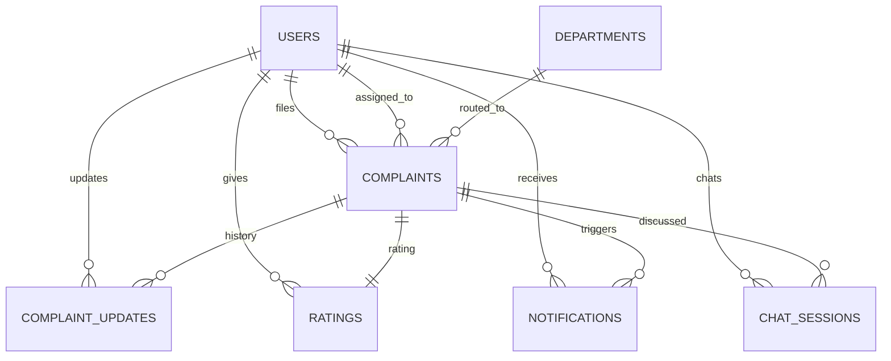

<div align="center">

# 🏛️ NAGRIK AI

### AI-Powered Civic Complaint Management Platform

[](https://python.org)
[](https://fastapi.tiangolo.com)
[](https://vuejs.org)
[](https://postgresql.org)
[](https://redis.io)
[](https://docs.celeryq.dev)

**Team 059** • IIT Madras • Software Engineering • 2026

</div>

---

## What this project actually does

NAGRIK AI is a civic complaint platform for Mumbai. A citizen can report a problem like a pothole, a water leak, or an overflowing drain, either by filling out a form or by just chatting with an AI assistant called Nagrik Saathi about it. The system reads the complaint, figures out how urgent it is, decides which BMC department should handle it, and checks whether it looks like a duplicate of something already reported. Staff and admins are meant to review, assign, and resolve these complaints from their own dashboards.

Right now, on `develop`, the login and signup flow and the chatbot are both fully real. They talk to an actual FastAPI backend, a real Postgres database, and real AI models. Most of the rest of the citizen, staff, and admin pages still run on sample data stored in the browser, since those parts haven't been connected to the backend yet. This guide will walk you through getting the whole thing running on your own machine so you can actually click around and test it, not just read about it.

---

## Setting everything up on your own machine

This section is written so you can follow it top to bottom without already knowing how the project is put together. If you get stuck anywhere, check the troubleshooting section near the end first, since it covers the exact problems people on this team have already hit while setting this up.

### What you need installed first

You will need Python 3.12 or newer, Node.js 18 or newer, PostgreSQL, Redis, and Git. If you already have these, you can skip ahead. If not, install them for your operating system before continuing (Homebrew on Mac, apt on Linux, or the official installers on Windows all work fine).

Check what you already have with:
```bash
python3 --version
node --version
psql --version
redis-cli --version
```

### Step 1: Get the code

```bash
git clone https://github.com/24f2000777/MAY2026-Team-059.git
cd MAY2026-Team-059
git checkout develop
git pull origin develop
```

### Step 2: Set up the backend

Move into the Backend folder and create a virtual environment. This keeps this project's Python packages separate from anything else on your machine.

```bash
cd Backend
python3 -m venv venv
source venv/bin/activate
```

If you are on Windows, activate it with `venv\Scripts\activate` instead.

Now install everything the backend needs:
```bash
pip install --upgrade pip
pip install -r requirements.txt
```

This step downloads quite a lot, since the AI and machine learning libraries are large. Give it a few minutes on a normal connection.

### Step 3: Set up your environment file

Copy the example environment file and open it in your editor:
```bash
cp .env.example .env
```

You need to fill in a few things:

Your database connection string, pointing at a Postgres database you can reach. If you are running Postgres locally, create the database first:
```bash
sudo -u postgres psql -c "CREATE DATABASE nagrik_ai;"
```

A `SECRET_KEY` and an `OTP_SECRET_KEY`, each at least 32 characters and different from each other. You can generate a good random one with:
```bash
python3 -c "import secrets; print(secrets.token_hex(32))"
```

At least one AI provider key, since the chatbot and the automatic priority scoring and categorization all depend on this. `GROQ_API_KEY` is the primary one this project uses, and it is genuinely fast and works well. `GEMINI_API_KEY` and `HUGGINGFACE_API_KEY` are backups the system falls through to automatically if Groq is ever slow or temporarily out of quota, so filling those in too makes your local setup much more reliable.

The SMTP settings for sending the verification email. You do not need your own email account for this. The `.env.example` file already has working credentials for a shared test inbox on a site called Ethereal, which is built exactly for this kind of local testing. Just copy those values across as they are, and skip ahead to the section below on how to actually read the OTP once it is sent there.

Your Redis connection URL, which for a local Redis install is usually just `redis://localhost:6379/0` and needs no further setup.

### Step 4: Start Redis and Postgres

Make sure both are actually running before you go any further:
```bash
redis-cli ping
```
This should print `PONG`. If Postgres was already running when you created the database earlier, it is already good to go.

### Step 5: Run the backend, in three separate terminal windows

The backend is not just one process. Sending the verification email happens in the background through Celery, so you need a Celery worker running, and there is also a nightly job that recalculates complaint priority scores, which needs Celery beat. Open three terminal tabs or windows, activate the virtual environment in each one, and run one of these in each:

Terminal 1, the Celery worker, which actually sends the emails:
```bash
cd Backend
source venv/bin/activate
celery -A app.core.celery_app worker --loglevel=info
```

Terminal 2, Celery beat, which schedules the nightly rescore job. This is not strictly required just to test login and the chatbot, but it is part of the real setup and only takes one more terminal:
```bash
cd Backend
source venv/bin/activate
celery -A app.core.celery_app beat --loglevel=info
```

Terminal 3, the actual API server:
```bash
cd Backend
source venv/bin/activate
uvicorn app.main:app --reload
```

Once that third command settles, you should see a line saying the application startup is complete. The API is now running at `http://127.0.0.1:8000`. You can open `http://127.0.0.1:8000/docs` in a browser right now to see every available endpoint and try them directly, which is a genuinely useful way to explore what the backend can do before you even touch the frontend.

### Step 6: Run the frontend

Open a fourth terminal window, this one does not need the virtual environment since it is a separate Node.js project:

```bash
cd frontend
npm install
npm run dev
```

Vite will print a URL once it starts, almost always `http://localhost:5173`. Open that in your browser.

---

## Actually using the app

Once both sides are running, here is how to try it out yourself.

### Creating an account

Go to the register page and fill in your name, a real-looking email address, a ten digit phone number, and a password. Submit it. The account gets created but starts out unverified, and the backend sends a six digit code to the email address you gave.

Since that email goes through the shared Ethereal test inbox by default, go to [ethereal.email](https://ethereal.email) and log in using the `SMTP_USERNAME` and `SMTP_PASSWORD` values from your `.env` file. You will see the email sitting there with your code in it. Nothing gets delivered anywhere real, so you can use any email address you like when registering.

If you would rather skip the browser step entirely, there is a small script you can run from the Backend folder that registers the same account and prints the code straight to your terminal instead of sending it anywhere:

```bash
python3 -c "
import asyncio
import app.services.auth_service as auth_service_module

def capture(*, recipient, otp):
    print(f'OTP for {recipient}: {otp}')

auth_service_module.send_verification_email = capture

from app.core.database import AsyncSessionLocal
from app.services.auth_service import register_user
from app.schemas.auth import RegisterRequest

async def main():
    async with AsyncSessionLocal() as db:
        await register_user(db, RegisterRequest(
            name='Your Name', phone='9123456789',
            email='you@example.com', password='YourPass123'
        ))

asyncio.run(main())
"
```

Type the code into the verification page. Once accepted, you are logged in immediately and taken to your citizen dashboard.

Every account created through the register page is a citizen by default. If you want to test what the app looks like as staff or as an admin, register normally and then update that one row directly in the database:
```sql
UPDATE users SET role = 'staff' WHERE email = 'you@example.com';
```
Use `role = 'admin'` instead if you want an admin account.

### Talking to Nagrik Saathi

Once logged in, open the Nagrik Saathi page from the navigation. This is a real chat with a real AI model behind it, not a scripted demo. Try describing an actual problem, something like telling it there is a large pothole near a specific street or a water pipe has burst in your area. If you give it enough detail, including roughly where it is, it will confirm the complaint back to you and quietly create a real row in the complaints table behind the scenes, complete with an automatically calculated priority score and the correct department already assigned.

You can also just ask it questions, like what the BMC helpline number is, and it will answer from its own knowledge base rather than making something up.

### Running the automated tests

The backend has a large real test suite, meaning the tests talk to an actual database and make actual calls to the AI providers rather than faking the responses. This takes a while to run since it is doing real work, often several minutes, but it gives you real confidence rather than a false sense of security.

```bash
cd Backend
source venv/bin/activate
pytest
```

You need Postgres and Redis running for this, same as the app itself.

---

## Troubleshooting things that will probably happen to you

These are real problems people on this team have actually run into while setting this up, not hypothetical ones.

**"Address already in use" when starting uvicorn or the frontend.** Something is already listening on that port, usually because a previous run of the same server never got shut down properly. Find and stop it before starting a fresh one:
```bash
lsof -nP -iTCP:8000 -sTCP:LISTEN
kill <the process id it prints>
```
The same trick works for port 5173 if the frontend complains.

**The login page says it could not reach the server, even though the backend is clearly running.** This is almost always a mismatch between which port the frontend is actually running on and which ports the backend allows requests from. If port 5173 was already taken when you started the frontend, Vite quietly picks 5174 or another nearby port instead, and the backend only accepts requests from 5173 and 3000 by default. Check what port Vite actually printed when it started, close that tab, free up 5173 using the steps above, and restart the frontend so it claims the right port.

**You registered but the OTP email never seems to arrive.** Two likely causes. Either the Celery worker from Step 5 is not actually running, since sending the email happens entirely through that background worker and nothing will be sent without it, or your SMTP settings in `.env` still have placeholder values instead of the real shared Ethereal credentials from `.env.example`. Fix whichever applies and try registering again, or use the terminal capture script from the section above to sidestep email entirely.

**The chatbot seems to hang for a very long time before replying, or never replies at all.** This almost always means the AI provider you are using has hit a rate limit or a quota. Groq's free tier resets on a rolling basis, usually within a minute or two, so waiting briefly and trying again often just works. If it keeps happening, check that you have a valid `GROQ_API_KEY` in your `.env`, and consider also filling in `GEMINI_API_KEY` and `HUGGINGFACE_API_KEY` so the system has somewhere real to fall back to instead of just one provider.

**A previous teammate's leftover test data is getting in your way.** Since everyone testing locally is hitting the same shared database if you are pointed at a shared instance, you might see complaints or accounts you did not create. This is expected in a shared testing environment. If it becomes a real problem, ask in the team channel before deleting anything that is not clearly your own test data.

---

# Frontend reference

A Vue 3 app for citizens, municipal staff, and administrators. Citizens file complaints, either through a form or by chatting with Nagrik Saathi, staff manage assigned tasks, and admins oversee everything with filters and analytics.

## Tech stack

Vue 3.5 with the Composition API and `<script setup>`, Vue Router 5 for routing and role based route guards, Pinia 3 for state management, and Vite 8 as the dev server and build tool. There is no UI kit and no chart library. Every chart and every bit of styling is hand built with plain SVG and CSS, kept deliberately dependency light.

## What is real and what is still sample data

| Store or API file | Talks to | Notes |
|---|---|---|
| `stores/authStore.js` through `api/authApi.js` | Real backend | register, verify OTP and log in, resend OTP, login, logout |
| `stores/chatStore.js` through `api/chatApi.js` | Real backend | Nagrik Saathi, real AI replies, real chat history saved per user |
| `stores/complaintStore.js` through `api/client.js` | Sample data in the browser | the complaint list, detail, and submission form pages, plus ratings |
| Profile, notifications, password reset | Sample data in the browser | not connected to the backend yet |

`api/client.js` is clearly marked as sample data at the top of the file. Every function in it is written to match exactly what a real endpoint would expect, so connecting it for real later just means rewriting the inside of each function, nothing about how the rest of the app calls it needs to change.

## How the login and signup flow works, step by step

You register with your name, email, a ten digit phone number, and a password of at least eight characters. This calls the real `POST /auth/register`, which creates an account that cannot log in yet and emails a real six digit code.

You land on the verification page next. Entering the correct code calls `POST /auth/verify-otp`, which activates the account and hands back real access and refresh tokens directly in that same response, so there is no separate login step needed right after and the app never has to hang onto your password just to log you in a moment later.

If the code never arrives, the resend button calls a dedicated `POST /auth/resend-otp` with just your email, no need to resubmit the whole form. This is limited to three requests per hour per email address to stop it being abused.

Logging in normally calls `POST /auth/login` with your email and password, and sends you to the right dashboard depending on whether you are a citizen, staff, or admin.

Logging out calls the real `POST /auth/logout`, which revokes your access token on the server itself, not just clearing it from your browser. That exact token cannot be reused after that, even if it had not technically expired yet.

One thing worth knowing if you look closely at browser storage while testing: your password is never written to `sessionStorage` or `localStorage` at any point, only your email is briefly held there between registering and verifying. This was a deliberate fix made after an earlier version briefly kept the plaintext password around to auto log you in after verifying.

There is no signup page for staff or admin accounts. Every account created through registration is a citizen. To test the other roles, register normally and then update that row's role directly in the database, as shown earlier in this guide.

## Nagrik Saathi in more detail

The chatbot page requires being logged in, same as the notifications and profile pages. Every message you type is sent to `POST /chat/message` and gets a genuine reply from a real language model back, not a scripted or keyword matched response, and both your message and the reply get saved to the database. Your conversation has an id that is generated once and kept in your browser's local storage, tied to your specific account, so reloading the page brings your same conversation back rather than starting over.

If you describe a real civic problem with enough detail, including where it is, the chatbot will extract the category and the location from what you said and file a genuine complaint through the exact same pipeline the regular submission form uses, complete with a priority score and a department assignment. A complaint filed through chat is not a lesser or fake version, it ends up identical in the database to one filed through the form.

## What each role can currently do

Public visitors can see the landing page, a FAQ, the privacy policy, terms of service, and a contact page, all without logging in.

Citizens get a dashboard with a personal greeting and summary cards, a report an issue form (still sample data for now, use the chatbot for a genuinely saved complaint today), a list of their own complaints, a detail view with a status timeline, and a page to rate a resolved complaint.

Staff get a dashboard of assigned tasks sorted by priority, and a page to update the status of a task.

Admins get a dashboard with summary cards and a filterable table, a page to assign or reassign complaints, and an analytics page with several charts.

Anyone logged in, regardless of role, can use Nagrik Saathi, view a notifications feed, edit their profile, and submit general feedback.

## Folder layout

```
frontend/src/
├── pages/
│   ├── LandingPage.vue, Login.vue, Register.vue, VerifyOtp.vue
│   ├── ForgotPassword.vue, ResetPassword.vue (sample data)
│   ├── CitizenDashboard.vue, SubmitComplaint.vue, ComplaintDetail.vue, RateReview.vue, CitizenAnalytics.vue
│   ├── StaffDashboard.vue, ComplaintUpdate.vue, StaffAnalytics.vue
│   ├── AdminDashboard.vue, AssignmentPage.vue, AnalyticsPage.vue
│   ├── NagrikSaathi.vue (real backend), Notifications.vue, Profile.vue, FeedbackReport.vue
│   ├── Faqs.vue, PrivacyPolicy.vue, TermsOfService.vue, ContactUs.vue
│   └── NotFound.vue
├── components/ Navbar.vue, DashboardHero.vue, ActionTile.vue, footer.vue,
│               ComplaintCard.vue, StatusBadge.vue, StatCard.vue, DonutChart.vue, LineChart.vue
├── stores/ authStore.js (real), chatStore.js (real), complaintStore.js (sample data)
├── api/
│   ├── client.js sample data layer for everything not listed below
│   ├── httpClient.js the real fetch wrapper, unwraps the backend's response envelope
│   ├── authApi.js real register, verify, resend, login, logout calls
│   └── chatApi.js real send message and get history calls
├── router/index.js all routes plus role based guards
└── assets/style.css global styling
```

---

# Backend reference

A FastAPI backend, async throughout, using SQLAlchemy 2.0 with asyncpg, JWT based authentication, Redis for OTP storage, rate limiting and token revocation, Celery for background email and the nightly rescore job, and a LangGraph powered chatbot with real retrieval augmented answers.

## Tech stack

FastAPI running async, Python 3.12, Pydantic v2 for validation. PostgreSQL 15 through SQLAlchemy's async ORM with asyncpg, with psycopg2 used only by one manual test script. JWT tokens through python jose, password hashing through passlib's bcrypt implementation, and HTTPBearer for extracting tokens from requests. Redis handles OTP storage, the logout token blacklist, and rate limiting. Celery handles email dispatch and the nightly priority rescore. On the AI side, Groq, Gemini, and HuggingFace are all wired in with automatic fallback between them, orchestrated with LangChain and LangGraph, with FAISS and sentence transformers powering the chatbot's knowledge base search.

## Full endpoint reference

Every protected endpoint expects an `Authorization: Bearer <access_token>` header. Access tokens last thirty minutes, refresh tokens last seven days.

### Authentication, under `/auth`

| Method | Path | Needs login | What it does |
|---|---|---|---|
| POST | `/register` | No | Creates an unverified citizen account and emails an OTP |
| POST | `/verify-otp` | No | Activates the account and returns real access and refresh tokens directly |
| POST | `/resend-otp` | No | Resends the OTP for a pending account, just needs the email, limited to three per hour |
| POST | `/login` | No | Returns access and refresh tokens |
| POST | `/refresh` | Yes | Exchanges a valid refresh token for a new access token |
| POST | `/logout` | Yes | Revokes the access token, and the refresh token too if you include it |
| GET | `/me` | Yes | Returns your own profile |
| PUT | `/me` | Yes | Updates your name or phone number |
| POST | `/change-password` | Yes | Changes your password while already logged in |
| POST | `/forgot-password` | No | Requests a password reset OTP, limited to three per hour per email |
| POST | `/reset-password` | No | Completes the password reset using the OTP |

### Complaints, under `/complaints`

| Method | Path | Needs login | What it does |
|---|---|---|---|
| POST | (root) | Yes | Creates a complaint, then immediately scores its priority, routes it to a department, and checks if it is high risk |
| GET | `/whoami` | Yes | A small debug route that returns your own id and email |

### Chat, under `/chat`

| Method | Path | Needs login | What it does |
|---|---|---|---|
| POST | `/message` | Yes | Sends a message to Nagrik Saathi, gets a real reply back, and may file a real complaint if the conversation described one |
| GET | `/history/{session_id}` | Yes | Returns every message in a session, only if it belongs to you |

### Machine learning services, under `/ml`

These are the same services the complaint submission and chatbot pipelines already use internally, also exposed individually so you can call them directly and inspect the results.

| Method | Path | What it does |
|---|---|---|
| GET and POST | `/priority/{complaint_id}` | Reads or recomputes a priority score |
| POST | `/rescore-all` | Rescoring in bulk, also runs automatically every night |
| GET and POST | `/categorize/{complaint_id}` | Reads or predicts a category |
| GET and POST | `/route-department/{complaint_id}` | Reads or recomputes which department a complaint goes to |
| GET | `/high-risk` | Lists complaints flagged as high risk |
| POST | `/check-duplicate` | Checks a draft complaint against existing ones |
| GET | `/duplicates/{complaint_id}` | Lists known duplicates of a specific complaint |

### Dashboard, under `/dashboard`

| Method | Path | Who can access it |
|---|---|---|
| GET | `/citizen` | citizens only |
| GET | `/staff` | staff only |
| GET | `/admin` | admins only |
| GET | `/internal` | staff or admins |

### Notifications, under `/notifications`

The router exists but has no actual endpoints wired up yet. The underlying model exists in the database already.

## The shape every response comes back in

A successful response looks like this:
```json
{ "success": true, "message": "Login successful.", "data": { "...": "..." }, "meta": null }
```

An error looks like this:
```json
{ "success": false, "message": "Invalid email or password.", "error_code": "AUTH_001", "details": null }
```

## Error codes you will see

| Code | What it means | HTTP status |
|---|---|---|
| AUTH_001 | Wrong email or password | 401 |
| AUTH_002 | Token expired | 401 |
| AUTH_003 | Token invalid, malformed, or revoked | 401 |
| AUTH_004 | You do not have permission for this | 403 |
| AUTH_005 | Account inactive, reserved for a future admin deactivation feature | 403 |
| AUTH_006 | Email not verified yet | 403 |
| AUTH_007 | Email already registered | 409 |
| AUTH_008 | Phone number already registered | 409 |
| AUTH_009 | User not found | 404 |
| AUTH_010 | OTP is invalid or expired | 400 |
| AUTH_011 | Account is already verified | 409 |
| AUTH_012 | That chat session belongs to someone else | 403 |
| RTE_001 | Rate limit exceeded | 429 |
| VAL_001 | Neither an address nor coordinates were given for the location | 422 |
| VAL_002 | Only one of latitude or longitude was given, they need to come together | 422 |

## Trying a complaint submission directly

```bash
curl -X POST http://localhost:8000/complaints \
  -H "Authorization: Bearer $ACCESS_TOKEN" \
  -H "Content-Type: application/json" \
  -d '{
    "title": "Large pothole on main road",
    "description": "There is a dangerous pothole near the school gate causing accidents.",
    "category": "pothole",
    "location": { "latitude": 23.0225, "longitude": 72.5714, "address": "Near Patel Chowk, Patan" }
  }'
```

The title needs to be between 5 and 100 characters, the description between 20 and 1000 characters, the category one of `road`, `pothole`, `streetlight`, `drainage`, `garbage`, `water_supply`, `sewage`, `traffic`, `electricity`, or `other`, and the location needs either an address, both coordinates, or all three together.

## How the backend code is organized

```text
Backend/
├── app/
│   ├── api/
│   │   ├── auth.py          11 endpoints, fully working
│   │   ├── complaints.py    submission plus a debug route, real and wired
│   │   ├── chat.py          2 endpoints, real AI replies and real complaint filing
│   │   ├── ml.py            10 endpoints
│   │   ├── dashboard.py     5 endpoints, one per role plus one shared
│   │   └── notifications.py stub, no endpoints yet
│   ├── chatbot/              conversation_graph.py, extractor.py, knowledge_base.py, providers.py, the LangGraph chatbot
│   ├── core/                 config.py, database.py, security.py, redis.py, exception_handlers.py, celery_app.py
│   ├── dependencies/         auth.py for get_current_user, roles.py for require_roles
│   ├── schemas/               auth.py, common.py, complaint.py (real and wired), chat.py, notification.py (stub)
│   ├── services/               auth_service.py, complaint_service.py, chat_service.py, otp_service.py,
│   │                            email_service.py, token_blacklist_service.py, rate_limit_service.py,
│   │                            priority_service.py, category_service.py, routing_service.py,
│   │                            duplicate_service.py, risk_alert_service.py, notification_service.py (stub)
│   ├── tasks/                   email_tasks.py, priority_tasks.py, notification_tasks.py (stub)
│   ├── utils/                    constants.py, exceptions.py, validators.py (stub)
│   ├── model.py                  User, Complaint, ComplaintUpdate, Notification, Rating, ChatSession, Department
│   └── main.py
├── Testing/                       the real test suite, see below
├── requirements.txt
└── .env.example
```

## Filling in your environment file, in more detail

```bash
cp .env.example .env
```

Then fill in your database credentials, a random `SECRET_KEY` and `OTP_SECRET_KEY` that are different from each other (generate one with `python -c "import secrets; print(secrets.token_hex(32))"`), your Redis URL, and at least one AI provider key. SMTP already defaults to the shared Ethereal sandbox mentioned earlier in this guide, so you do not need a real personal email account just to test locally.

## Running the tests

```bash
cd Backend
pytest
```

This suite hits a real database and makes real calls to whichever AI provider is configured, rather than faking any of it, since the whole point of many of these tests is proving the real behavior actually works. It covers authentication end to end including token issuance and rate limiting, role based access control tested from an attacker's point of view with forged tokens and permission escalation attempts, and the priority scoring, categorization, routing, duplicate detection, and chatbot pipelines. You need Postgres and Redis running for it, same as the app itself.

There are also two small standalone scripts at the very root of the repository, separate from the main test suite, worth knowing about if you are working on location validation specifically:
```bash
python3 location_validation.py
pytest test_location_validation.py
```

## Design documents that are not connected to anything yet

A handful of files sitting at the root of the repository are design documents only. They describe an intended API shape or schema but are not wired into the running application. Do not be confused if you go looking for the endpoint they describe and cannot find it, that is expected for now.

| File | What it describes | What actually exists today |
|---|---|---|
| `location_validation.py` | Location validation rules and error codes | A separate, already working version of the same idea lives in `Backend/app/schemas/complaint.py` |
| `api-doc.yaml` | A full draft OpenAPI contract for complaints, comments, and attachments | Some parts of it, like a client supplied priority field or a structured address, do not match what was actually built |
| `complaint_assign_schema.py` | The intended shape of a complaint assignment endpoint | No real endpoint exists yet, this is next on the roadmap |
| `complaint_internal_notes_schema.py` | The intended shape of an internal notes endpoint for staff | No real endpoint exists yet either |

If you end up building the real assign or internal notes endpoints, start from these two files. They have already been reviewed and their terminology already matches the real role names used elsewhere in the codebase.

## How the database is laid out

Seven tables in total: Users, Complaints, Complaint Updates, Notifications, Ratings, Chat Sessions, and Departments.



Every user has a role of either citizen, staff, or admin.

## How authentication actually works underneath

```
API route calls into auth_service.py, which holds all the actual business logic and has no dependency on FastAPI itself
    it in turn uses security.py for password hashing and JWT creation and decoding
    otp_service.py for generating and checking OTPs, hashed and stored in Redis with an expiry matching their purpose
    email_service.py for actually sending mail
    token_blacklist_service.py for handling logout revocation
    and rate_limit_service.py, a general purpose Redis based limiter used for forgot password, resend OTP, and OTP verification attempts
any failure raises a specific custom exception, which exception_handlers.py then converts into the standard error response shape
```

Passwords are hashed with bcrypt and never stored or logged in plain text. Access and refresh tokens are distinguished by a claim inside the token itself, so one can never be mistaken for the other, and every token carries a unique id that makes real server side logout possible. An OTP only ever exists in plain text for as long as it takes to email it, after that only its hash sits in Redis with a short expiry, and verifying it deletes that entry immediately so the same code can never be used twice.

Role based access control works through a single reusable dependency, `require_roles`, which you hand one or more allowed roles and it takes care of rejecting anyone else with a proper 403. This is tested from an actual attacker's perspective in `test_rbac_security.py`, including forged token signatures, tampered payloads, and expired tokens, all of which are correctly rejected.

## What Celery is doing in the background

Every verification and password reset email goes out asynchronously through a Celery task rather than blocking the request that triggered it. Separately, Celery Beat runs a nightly job at 2 AM IST that recalculates the priority score for every complaint in the system. Notification creation on status change, scheduled auto closing of old complaints, and generating PDF reports are all planned for Celery later but not built yet.

## Where the project actually stands right now

**Done and genuinely tested:** the full authentication flow including resend OTP, role based access control, complaint submission through both the form's backend and the chatbot, the machine learning pipeline for priority scoring, categorization, department routing, and duplicate detection, and the chatbot itself filing real complaints. All of this is covered by a real, passing test suite.

**Built but still running on sample data on the frontend, or missing a real backend endpoint:** the citizen's profile page, notifications, and password reset flow, the complaint list, detail, and ratings pages, and on the backend, the complaint assignment and internal notes endpoints, for which the design already exists.

**Planned but not started:** the complaint status workflow of approving, starting, resolving, and rejecting a complaint, photo evidence upload, automatically closing old resolved complaints, a proper deployment setup with Docker and continuous integration, and a dedicated security audit pass before any real launch.

---

## How we work as a team on this repository

```bash
git checkout develop
git pull origin develop
git checkout -b feature/your-feature-name
# do your work, committing in small, meaningful chunks
git push -u origin feature/your-feature-name
# then open a pull request from your branch into develop
```

Nothing gets merged directly into `main`. Before opening a pull request, make sure your code actually runs, there are no secrets hardcoded anywhere, your tests pass, and any new dependency you added is in `requirements.txt`.

## The team

| Name | What they own |
|---|---|
| Amit Kumar Pandey | Backend architecture, authentication, complaint APIs, database |
| Akshit | AI engine, priority prediction, the RAG chatbot |
| Ravisha | Testing, QA, complaint schema design, documentation |
| Lakshay Bansal | Frontend, Vue pages, routing, the auth store |
| Arubhi Bansal | Scrum master, frontend support |

## License

This project exists for academic and educational purposes as part of IIT Madras's Software Engineering coursework. All rights remain with the project's contributors unless stated otherwise.
